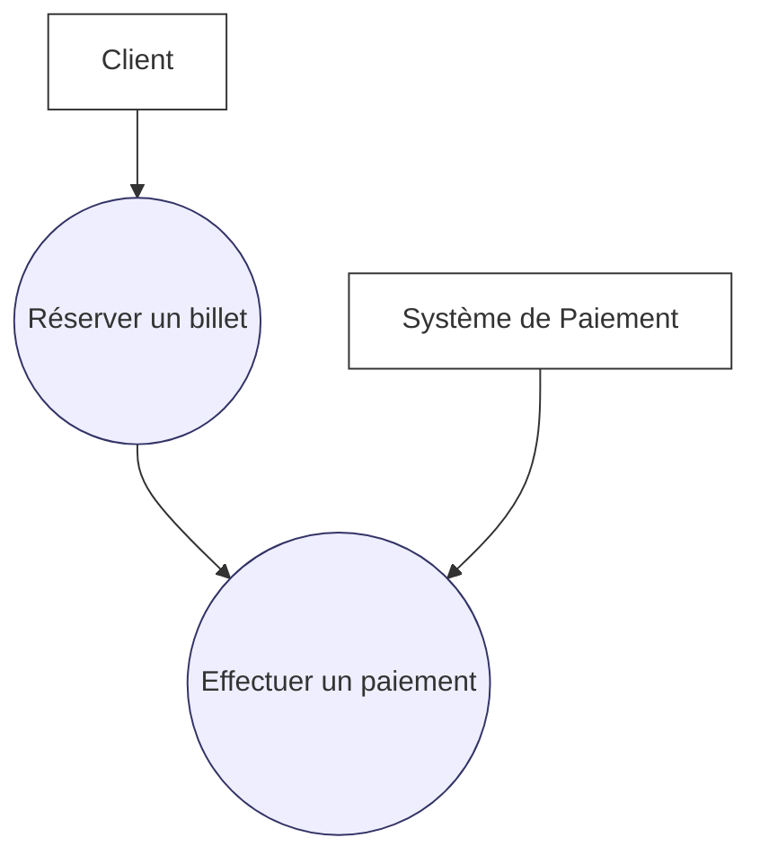
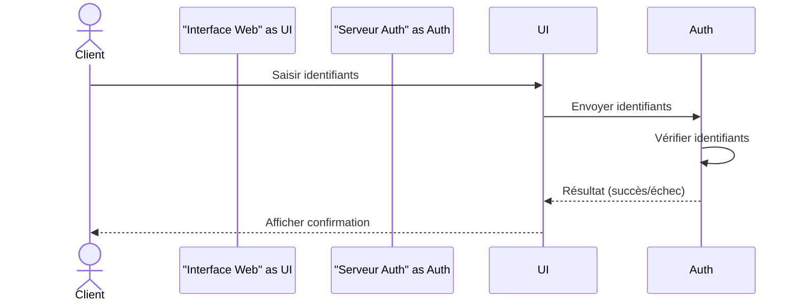
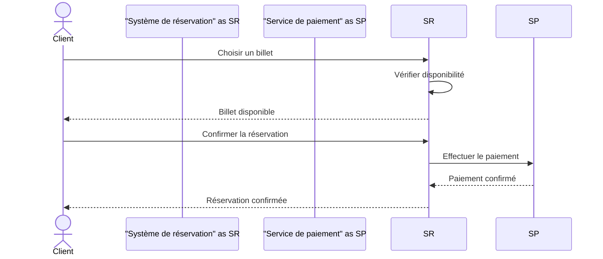

# Cours : Diagrammes de cas d’utilisation et diagrammes de séquence

## 1. Introduction

Dans le processus de conception orientée objet (UML), les **diagrammes de cas d’utilisation** et les **diagrammes de séquence** permettent de représenter deux aspects complémentaires :

* **Cas d’utilisation** : vue fonctionnelle du système (ce que les acteurs peuvent faire).
* **Séquence** : vue dynamique du système (comment les objets interagissent dans le temps pour réaliser un scénario).

---

## 2. Diagramme de cas d’utilisation (rappel)

Un **diagramme de cas d’utilisation** montre :

* Les **acteurs** (utilisateurs ou systèmes externes).
* Les **cas d’utilisation** (fonctions principales).
* Les relations entre acteurs et cas d’utilisation.

### Exemple (réserver un billet en ligne)



---

## 3. Diagramme de séquence

### 3.1. Définition

Un **diagramme de séquence** représente :

* Les **objets/acteurs** en interaction (en haut).
* Le **temps** qui s’écoule de haut en bas.
* Les **messages échangés** entre objets.

Il illustre la **chronologie des échanges** nécessaires à la réalisation d’un scénario précis.

---

### 3.2. Notations de base

* **Acteurs/Objets** : représentés par un rectangle avec un trait vertical (ligne de vie).
* **Messages** : flèches horizontales (appels, réponses, signaux).
* **Activation** : barre étroite sur la ligne de vie indiquant qu’un objet exécute une opération.
* **Retour** : flèche en pointillés.

---

### 3.3. Exemple 1 – Authentification utilisateur

**Scénario** : Un client se connecte à une application web.

1. Le client saisit son identifiant/mot de passe.
2. Le système valide les informations.
3. Le système confirme la connexion.



---

### 3.4. Exemple 2 – Réservation d’un billet

**Scénario** :

1. Le client choisit un billet.
2. Le système de réservation valide la disponibilité.
3. Le client effectue un paiement via un service externe.
4. Le système confirme la réservation.



---

## 4. Comparaison des deux diagrammes

| Aspect       | Cas d’utilisation             | Séquence                               |
| ------------ | ----------------------------- | -------------------------------------- |
| Point de vue | Fonctionnel (quoi ?)          | Dynamique (comment ?)                  |
| Éléments     | Acteurs + cas d’utilisation   | Acteurs/objets + messages              |
| Utilité      | Spécifier les fonctionnalités | Détailler le déroulement d’un scénario |

---

## 5. Exercices pratiques

1. **Exercice 1** : Dessiner un diagramme de cas d’utilisation pour une **bibliothèque en ligne** (chercher, emprunter, rendre un livre).
2. **Exercice 2** : Réaliser le diagramme de séquence pour le scénario « Emprunter un livre ».
3. **Exercice 3** : Ajouter une alternative dans le diagramme de séquence (ex. : livre non disponible).


# Annexe 1 : Signification des symboles dans un diagramme de séquence

| Symbole / Élément          | Signification                                             |                                                                        |
| -------------------------- | --------------------------------------------------------- | ---------------------------------------------------------------------- |
| `actor`                    | Représente un utilisateur ou système externe.             |                                                                        |
| `participant`              | Représente un objet ou composant du système.              |                                                                        |
| Ligne verticale (          | )                                                         | **Ligne de vie** : durée de vie de l’acteur/objet pendant le scénario. |
| `->>` (flèche pleine)      | Message synchrone (appel de méthode ou action).           |                                                                        |
| `-->>` (flèche pointillée) | Retour ou réponse d’un message.                           |                                                                        |
| `->>` vers soi-même        | Message interne (auto-appel ou vérification locale).      |                                                                        |
| Barre étroite (activation) | Période où l’objet exécute une action.                    |                                                                        |
| Temps (axe vertical)       | Le scénario se lit de haut en bas (plus bas = plus tard). |                                                                        |
| `alt` … `else` … `end`     | Bloc alternatif (conditions ou choix dans le flux).       |                                                                        |
| `loop` … `end`             | Bloc de répétition (exécution répétée d’un message).      |                                                                        |
| `note`                     | Annotation (commentaire ajouté pour clarifier un pas).    |                                                                        |


# Annexe 2 – Signification des symboles dans un diagramme de séquence

## 1. Acteurs et participants

* **`actor`** : représente un utilisateur externe ou un système tiers qui interagit avec le système étudié.
* **`participant`** : représente un objet, une classe, un service ou un composant interne au système.
* **Représentation visuelle** :

  * Acteurs → petit bonhomme ou rectangle en tête de ligne.
  * Participants → rectangle avec leur nom en haut du diagramme.
* **Ligne verticale** : appelée **ligne de vie (lifeline)**, elle montre la présence de l’acteur ou de l’objet tout au long du scénario.

---

## 2. Ligne de vie

* Chaque acteur/participant possède une **ligne verticale**.
* Le **temps s’écoule de haut en bas** :

  * Les événements en haut arrivent en premier.
  * Les événements plus bas arrivent après.
* Une ligne de vie ne disparaît pas : elle reste active pendant toute la durée du scénario.

---

## 3. Messages et flèches

* **Message synchrone (appel)**

  * Notation : `A ->> B: Message`
  * Signification : A envoie une requête à B, et attend une réponse.
* **Message asynchrone**

  * Notation : `A ->>+ B: Message` (Mermaid simplifie en `->>`)
  * Signification : A envoie une requête à B mais continue son exécution sans attendre de réponse.
* **Retour (réponse)**

  * Notation : `B -->> A: Résultat`
  * Signification : B renvoie une valeur, un message de confirmation ou un résultat à A.
  * Flèche pointillée pour bien distinguer de l’appel.
* **Appel à soi-même (auto-appel)**

  * Notation : `Obj ->> Obj: Action interne`
  * Signification : un objet exécute une méthode de lui-même (souvent pour une vérification interne).

---

## 4. Activation (barres étroites)

* Représentée par un **rectangle étroit sur la ligne de vie**.
* Montre que l’objet est en train d’exécuter une opération suite à un appel.
* Exemple : lorsqu’un serveur reçoit une requête, sa ligne de vie est activée le temps du traitement.

---

## 5. Blocs de contrôle (structures avancées)

Mermaid et UML permettent d’ajouter des structures logiques pour représenter des cas alternatifs ou répétitifs :

* **Alternative (alt / else / end)**

  ```mermaid
  sequenceDiagram
    participant A
    participant B
    alt Condition vraie
        A ->> B: Action si vrai
    else Condition fausse
        A ->> B: Action si faux
    end
  ```

  * Sert à montrer des **choix** ou des **branches conditionnelles**.

* **Option (opt / end)**

  * Comme `alt`, mais avec un seul chemin (condition facultative).

* **Boucle (loop / end)**

  ```mermaid
  sequenceDiagram
    participant A
    participant B
    loop Chaque élément de la liste
        A ->> B: Action répétée
    end
  ```

  * Sert à représenter une **répétition** d’actions.

* **Parallèle (par / and / end)** *(disponible dans UML standard mais pas encore dans Mermaid)*

  * Permet de montrer des actions exécutées en parallèle.

---

## 6. Notes et commentaires

* **Note attachée à un participant** :

  ```mermaid
  sequenceDiagram
    participant A
    participant B
    Note over A: Ceci est un commentaire
    A ->> B: Action
  ```
* Sert à documenter un pas important du scénario (règle métier, condition, contexte).

---

## 7. Signification du temps

* Le temps est **implicite** : il descend du haut vers le bas.
* Chaque flèche horizontale représente un événement daté dans l’ordre.
* Plus bas dans le diagramme = plus tard dans le scénario.

---

## 8. Résumé visuel (tableau synthétique)

| Symbole / Mot-clé         | Signification                          |
| ------------------------- | -------------------------------------- |
| `actor`                   | Utilisateur ou système externe         |
| `participant`             | Objet, classe, service interne         |
| Ligne verticale           | Ligne de vie (existence dans le temps) |
| `->>`                     | Message synchrone (appel)              |
| `-->>`                    | Retour ou réponse                      |
| `->> Obj` (vers soi-même) | Auto-appel / action interne            |
| Rectangle étroit          | Activation (exécution d’une opération) |
| `alt … else … end`        | Alternative (choix conditionnel)       |
| `opt … end`               | Option (condition facultative)         |
| `loop … end`              | Répétition (boucle)                    |
| `note`                    | Commentaire, explication               |
| Haut → bas                | Ordre chronologique (temps qui passe)  |


