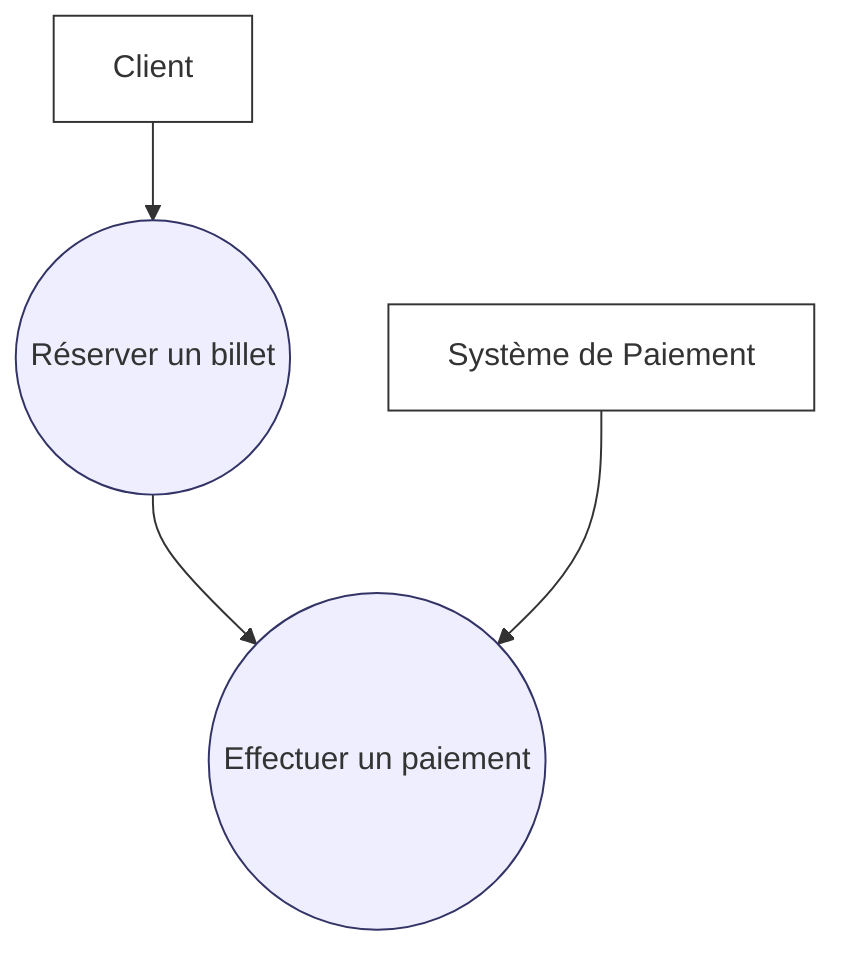
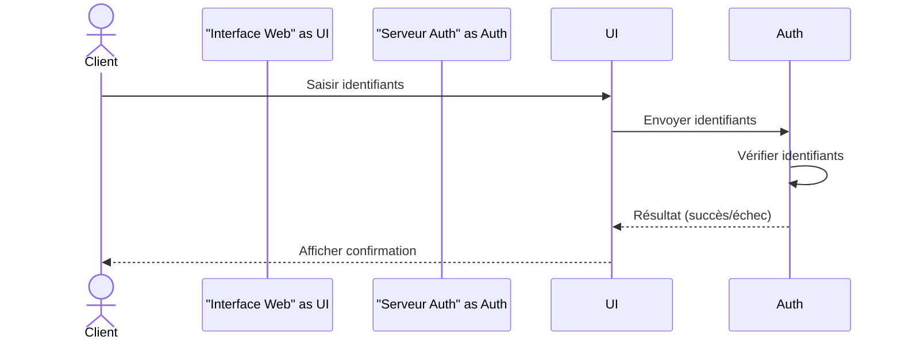
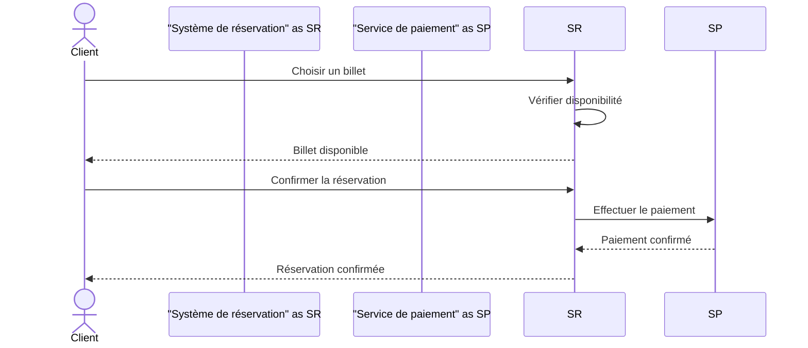

# Cours : Diagrammes de cas d’utilisation et diagrammes de séquence

## 1. Introduction

Dans le processus de conception orientée objet (UML), les **diagrammes de cas d’utilisation** et les **diagrammes de séquence** permettent de représenter deux aspects complémentaires :

* **Cas d’utilisation** : vue fonctionnelle du système (ce que les acteurs peuvent faire).
* **Séquence** : vue dynamique du système (comment les objets interagissent dans le temps pour réaliser un scénario).

---

## 2. Diagramme de cas d’utilisation (rappel)

Un **diagramme de cas d’utilisation** montre :

* Les **acteurs** (utilisateurs ou systèmes externes).
* Les **cas d’utilisation** (fonctions principales).
* Les relations entre acteurs et cas d’utilisation.

### Exemple (réserver un billet en ligne)

---

## 3. Diagramme de séquence

### 3.1. Définition

Un **diagramme de séquence** représente :

* Les **objets/acteurs** en interaction (en haut).
* Le **temps** qui s’écoule de haut en bas.
* Les **messages échangés** entre objets.

Il illustre la **chronologie des échanges** nécessaires à la réalisation d’un scénario précis.

---

### 3.2. Notations de base

* **Acteurs/Objets** : représentés par un rectangle avec un trait vertical (ligne de vie).
* **Messages** : flèches horizontales (appels, réponses, signaux).
* **Activation** : barre étroite sur la ligne de vie indiquant qu’un objet exécute une opération.
* **Retour** : flèche en pointillés.

---

### 3.3. Exemple 1 – Authentification utilisateur

**Scénario** : Un client se connecte à une application web.

1. Le client saisit son identifiant/mot de passe.
2. Le système valide les informations.
3. Le système confirme la connexion.

---

### 3.4. Exemple 2 – Réservation d’un billet

**Scénario** :

1. Le client choisit un billet.
2. Le système de réservation valide la disponibilité.
3. Le client effectue un paiement via un service externe.
4. Le système confirme la réservation.

---

## 4. Comparaison des deux diagrammes

| Aspect       | Cas d’utilisation             | Séquence                               |
| ------------ | ----------------------------- | -------------------------------------- |
| Point de vue | Fonctionnel (quoi ?)          | Dynamique (comment ?)                  |
| Éléments     | Acteurs + cas d’utilisation   | Acteurs/objets + messages              |
| Utilité      | Spécifier les fonctionnalités | Détailler le déroulement d’un scénario |

---

## 5. Exercices pratiques

1. **Exercice 1** : Dessiner un diagramme de cas d’utilisation pour une **bibliothèque en ligne** (chercher, emprunter, rendre un livre).
2. **Exercice 2** : Réaliser le diagramme de séquence pour le scénario « Emprunter un livre ».
3. **Exercice 3** : Ajouter une alternative dans le diagramme de séquence (ex. : livre non disponible).

