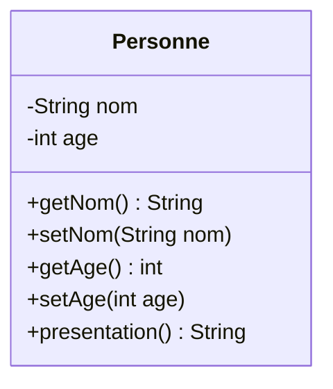
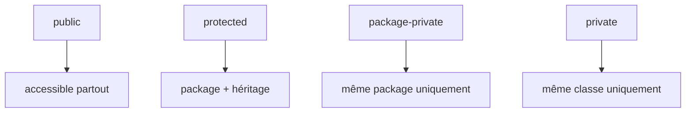
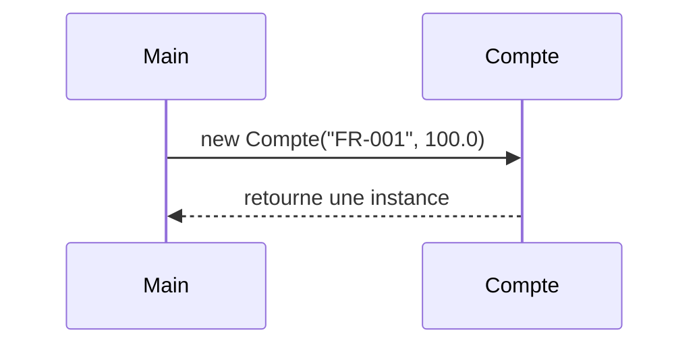
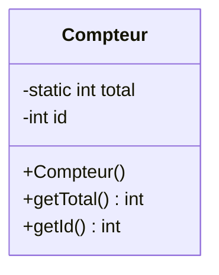
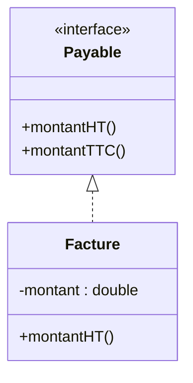

# Cours Java — Création de Classes et Objets

## 1) Concept fondamental : la classe et l’objet

Une **classe** est une **abstraction** d’un concept réel (ex. : une Personne, un Compte Bancaire).
Un **objet** est une **instance concrète** de cette classe.



👉 **Attributs** : variables décrivant l’état d’un objet.
👉 **Méthodes** : comportements de l’objet.


## 2) Définition d’une classe en Java

```java
public class Personne {
    // Attributs privés
    private String nom;
    private int age;

    // Méthodes publiques
    public String getNom() { return nom; }
    public void setNom(String nom) { this.nom = nom; }

    public int getAge() { return age; }
    public void setAge(int age) { this.age = age; }

    public String presentation() {
        return "Je m'appelle " + nom + " et j'ai " + age + " ans.";
    }
}
```


## 3) Visibilité des classes et des membres

Java propose quatre niveaux de visibilité :

| Modificateur | Classe | Package | Sous-classe | Partout |
| ------------ | ------ | ------- | ----------- | ------- |
| `public`     | ✔      | ✔       | ✔           | ✔       |
| `protected`  | ✔      | ✔       | ✔           | ✘       |
| *(package)*  | ✔      | ✔       | ✘           | ✘       |
| `private`    | ✔      | ✘       | ✘           | ✘       |




## 4) Paquetages (packages)

Un **package** organise les classes et limite la visibilité.

Exemple d’arborescence :

```
src/
 └── com/
      └── banque/
           ├── Compte.java
           └── Client.java
```

Déclaration en début de fichier :

```java
package com.banque;

public class Compte { ... }
```


## 5) Constructeurs et instanciation

Un constructeur initialise un objet :

```java
public class Compte {
    private String numero;
    private double solde;

    // Constructeur
    public Compte(String numero, double solde) {
        this.numero = numero;
        this.solde = solde;
    }
}
```

Instanciation :

```java
public class Demo {
    public static void main(String[] args) {
        Compte c = new Compte("FR-001", 100.0);
        System.out.println(c);
    }
}
```




## 6) Surcharge de méthodes

La **surcharge** permet plusieurs méthodes avec le **même nom** mais des **signatures différentes** :

```java
public class Calculatrice {
    public int addition(int a, int b) { return a + b; }
    public double addition(double a, double b) { return a + b; }
    public int addition(int a, int b, int c) { return a + b + c; }
}
```


## 7) Membres de classe vs membres d’instance

* **Instance** : appartient à un objet (`this`)
* **Classe (`static`)** : partagé par toutes les instances

```java
public class Compteur {
    private static int total = 0; // commun à toutes les instances
    private int id;

    public Compteur() {
        total++;
        this.id = total;
    }

    public static int getTotal() { return total; }
    public int getId() { return id; }
}
```




## 8) Interfaces : définition et utilisation

Une **interface** définit un **contrat** sans implémentation obligatoire.

```java
public interface Payable {
    double montantHT();

    default double montantTTC() {
        return montantHT() * 1.05;
    }
}
```

```java
public class Facture implements Payable {
    private double montant;
    public Facture(double montant) { this.montant = montant; }
    @Override
    public double montantHT() { return montant; }
}
```




## 9) Différence classe abstraite vs interface

| Aspect            | Interface                         | Classe Abstraite              |
| ----------------- | --------------------------------- | ----------------------------- |
| Héritage multiple | ✔ (implémente plusieurs)          | ✘ (1 seule classe mère)       |
| Attributs         | constantes uniquement             | attributs possibles           |
| Implémentation    | depuis Java 8, méthodes `default` | peut contenir du code complet |
| Usage             | définir un **contrat**            | factoriser du **code commun** |


## 10) Exercices dirigés

1. Créez une classe `Rectangle` avec :

   * attributs `largeur`, `hauteur`
   * méthodes `aire()`, `perimetre()`
   * surcharge d’un constructeur `(double cote)`.

2. Créez une interface `Forme` avec méthode `double aire()`.
   Implémentez-la dans `Rectangle` et `Cercle`.

3. Créez une classe `Compteur` avec attribut `static` pour compter les objets créés.


## 11) Conclusion

* **Classe** = plan de construction.
* **Objet** = instance concrète.
* **Visibilité** = contrôle d’accès (`public`, `private`, etc.).
* **Constructeur** = initialise l’objet.
* **Surcharge** = plusieurs signatures.
* **Static** = partagé par tous.
* **Interface** = contrat de programmation.

