# 📘 Cours  sur les Interfaces en Java

## 1. Introduction

Une **interface** en Java définit un **contrat** : un ensemble de méthodes (et éventuellement de constantes, méthodes par défaut, méthodes statiques) que les classes implémentant l’interface doivent respecter.

* **Classe** = définit des données et comportements.
* **Interface** = définit uniquement des **capacités**, sans implémentation complète (sauf `default`/`static` depuis Java 8, `private` depuis Java 9).

👉 Une interface **ne peut pas être instanciée directement**.
👉 Une classe peut **implémenter plusieurs interfaces** (Java gère l’héritage multiple d’interfaces).

<br/>
<br/>

## 2. Déclaration d’une interface

```java
public interface Vehicule {
    void demarrer();   // méthode abstraite implicite
    void arreter();    // méthode abstraite implicite
}
```

* Toutes les méthodes **sans corps** sont automatiquement :

  * `public`
  * `abstract`
* Toute variable définie dans une interface est :

  * `public`
  * `static`
  * `final`

<br/>
<br/>

## 3. Implémentation d’une interface

```java
public class Voiture implements Vehicule {
    @Override
    public void demarrer() {
        System.out.println("La voiture démarre.");
    }

    @Override
    public void arreter() {
        System.out.println("La voiture s'arrête.");
    }
}
```

```java
public class Main {
    public static void main(String[] args) {
        Vehicule v = new Voiture(); // polymorphisme
        v.demarrer();
        v.arreter();
    }
}
```

📌 **Sortie attendue**

```
La voiture démarre.
La voiture s'arrête.
```

<br/>
<br/>

## 4. Constantes dans une interface

```java
public interface Constantes {
    int VITESSE_MAX = 120; // public static final implicite
}
```

```java
public class Moto implements Vehicule, Constantes {
    @Override
    public void demarrer() {
        System.out.println("Moto démarre avec vitesse max " + VITESSE_MAX);
    }

    @Override
    public void arreter() {
        System.out.println("Moto arrêtée.");
    }
}
```

📌 **Sortie**

```
Moto démarre avec vitesse max 120
Moto arrêtée.
```

<br/>
<br/>

## 5. Méthodes par défaut (`default`) – Java 8+

Permet de donner une implémentation **par défaut**.

```java
public interface Vehicule {
    void demarrer();
    void arreter();

    default void klaxonner() {
        System.out.println("Bip bip !");
    }
}
```

```java
public class Bus implements Vehicule {
    @Override
    public void demarrer() { System.out.println("Bus démarre."); }
    @Override
    public void arreter() { System.out.println("Bus arrêté."); }
}
```

```java
public class Main {
    public static void main(String[] args) {
        Vehicule b = new Bus();
        b.demarrer();
        b.klaxonner(); // méthode héritée sans réécriture obligatoire
    }
}
```

📌 **Sortie**

```
Bus démarre.
Bip bip !
```

<br/>
<br/>

## 6. Méthodes statiques dans les interfaces

```java
public interface MathUtil {
    static int carre(int x) {
        return x * x;
    }
}
```

```java
public class Main {
    public static void main(String[] args) {
        int res = MathUtil.carre(5); // Appel direct via l’interface
        System.out.println(res);
    }
}
```

📌 **Sortie**

```
25
```

<br/>
<br/>

## 7. Méthodes privées dans les interfaces (Java 9+)

Utile pour factoriser du code commun aux `default` et `static`.

```java
public interface Logger {
    private void log(String msg) {
        System.out.println("[LOG] " + msg);
    }

    default void info(String msg) {
        log("INFO: " + msg);
    }

    default void error(String msg) {
        log("ERROR: " + msg);
    }
}
```

<br/>
<br/>

## 8. Héritage multiple avec interfaces

Une classe peut implémenter plusieurs interfaces :

```java
interface Volant { void voler(); }
interface Nageant { void nager(); }

public class Canard implements Volant, Nageant {
    @Override
    public void voler() { System.out.println("Le canard vole."); }
    @Override
    public void nager() { System.out.println("Le canard nage."); }
}
```

📌 Sortie

```
Le canard vole.
Le canard nage.
```

<br/>
<br/>

## 9. Conflit de méthodes par défaut

Si deux interfaces définissent une méthode `default` identique → **la classe doit résoudre le conflit**.

```java
interface A {
    default void saluer() { System.out.println("Bonjour de A"); }
}
interface B {
    default void saluer() { System.out.println("Bonjour de B"); }
}

public class C implements A, B {
    @Override
    public void saluer() {
        A.super.saluer(); // résolution explicite
        B.super.saluer();
    }
}
```

📌 Sortie

```
Bonjour de A
Bonjour de B
```

<br/>
<br/>

## 10. Interfaces fonctionnelles & Lambdas (Java 8+)

Une interface avec **une seule méthode abstraite** = *fonctionnelle* → utilisable avec les lambdas.

```java
@FunctionalInterface
interface Calculateur {
    int operation(int a, int b);
}
```

```java
public class Main {
    public static void main(String[] args) {
        Calculateur addition = (x, y) -> x + y;
        Calculateur multiplication = (x, y) -> x * y;

        System.out.println(addition.operation(3, 5));      // 8
        System.out.println(multiplication.operation(3, 5)); // 15
    }
}
```

<br/>
<br/>

## 11. Interfaces vs Classes Abstraites

| Caractéristique   | Interface                                  | Classe Abstraite                               |
| ----------------- | ------------------------------------------ | ---------------------------------------------- |
| Héritage multiple | ✔ (plusieurs interfaces)                   | ✘ (une seule superclasse)                      |
| Constructeurs     | ✘                                          | ✔                                              |
| Variables         | `public static final` uniquement           | Tous types                                     |
| Méthodes          | Abstraites, `default`, `static`, `private` | Abstraites et concrètes                        |
| Objectif          | Définir un contrat                         | Définir un comportement partiel et état commun |

<br/>
<br/>

## 12. Exemples avancés

### Interface pour un plugin système

```java
public interface Plugin {
    String getNom();
    void executer();
}
```

```java
public class PluginImpression implements Plugin {
    public String getNom() { return "Impression"; }
    public void executer() { System.out.println("Impression en cours..."); }
}
```

<br/>
<br/>

## 13. Exercices pratiques

### Exercice 1

Créer une interface `Animal` avec `manger()` et `dormir()`. Implémenter `Chat` et `Chien`.

✅ Attendu : comprendre `implements` et polymorphisme.

<br/>
<br/>

### Exercice 2

Créer deux interfaces `Volant` et `Marin`. Créer une classe `Hydravion` qui implémente les deux.

✅ Attendu : héritage multiple.

<br/>
<br/>

### Exercice 3

Créer une interface `Operation` fonctionnelle. Tester des lambdas pour addition, soustraction, multiplication.

✅ Attendu : comprendre les **interfaces fonctionnelles**.

<br/>
<br/>

### Exercice 4

Créer deux interfaces avec la même méthode `default`. Implémenter une classe qui résout le conflit.

✅ Attendu : maîtrise des `super` spécifiques (`A.super.methode()`).

<br/>
<br/>

## 14. Commandes pour tester

* Compilation (Linux/macOS) :

```bash
javac -d out $(find src -name "*.java")
java -cp out Main
```

* Compilation (Windows PowerShell) :

```powershell
$files = Get-ChildItem -Recurse src -Filter *.java | % { $_.FullName }
javac -d out $files
java -cp out Main
```

<br/>
<br/>

## 15. Points clés à retenir

1. **Interface = contrat**.
2. Une classe peut **implémenter plusieurs interfaces**.
3. Méthodes : `abstract` (par défaut), `default`, `static`, `private`.
4. Variables : toujours `public static final`.
5. Conflits → résolus via `Interface.super.methode()`.
6. Interfaces fonctionnelles = base des **lambdas** et **API Streams**.


<br/>
<br/>
<br/>

### Annexe A — Contrat `Vehicule` et implémentations

```mermaid
classDiagram
class Vehicule {
  <<interface>>
  +demarrer()
  +arreter()
  %% La vraie implémentation "default" n'est pas visible en UML ; indiquée ici comme note %%
}
class Voiture {
  +demarrer()
  +arreter()
}
class Bus {
  +demarrer()
  +arreter()
  +klaxonner()  %% hérite de la default "klaxonner()" de Vehicule %%
}
Vehicule <|.. Voiture
Vehicule <|.. Bus
```



---

### Annexe B — Interface de constantes (contrat de valeurs) + multi-implémentation


---

### Annexe C — Méthodes `default`/`static`/`private` (vue conceptuelle)


> Remarque : Mermaid ne fait pas la différence d’exécution entre `default` et `abstract`. Les notes ci-dessus documentent l’intention Java.

---

### Annexe D — Héritage multiple d’interfaces


---

### Annexe E — Conflit de méthodes par défaut et résolution via `Interface.super`

```mermaid
classDiagram
class A {
  <<interface>>
  +saluer()  %% default %%
}
class B {
  <<interface>>
  +saluer()  %% default %%
}
class C {
  +saluer()  %% résout le conflit : A.super.saluer(); B.super.saluer(); %%
}
C ..|> A
C ..|> B
```



---

### Annexe F — Interface fonctionnelle et lambdas

```mermaid
classDiagram
class Calculateur
<<interface>> Calculateur
Calculateur : +operation(a:int, b:int) int

class LambdaAddition
LambdaAddition ..|> Calculateur
```


---

Tu as deux petits soucis qui font planter Mermaid sur GitHub :

1. `<<interface>>` ne doit pas être placé **dans** le bloc de la classe. Il faut le mettre **au niveau racine** (stéréotype appliqué à la classe).
2. Les commentaires `%%` **à l’intérieur des accolades** d’une classe provoquent souvent une erreur du parseur GitHub. Mets-les hors des blocs ou supprime-les.

Voici trois versions qui passent sur GitHub.

---

## Version simple et correcte

```mermaid
classDiagram
class Calculateur
<<interface>> Calculateur
Calculateur : +operation(a:int, b:int) int

class LambdaAddition
LambdaAddition ..|> Calculateur
```

---

## Version avec blocs de classe (sans commentaires internes)


---

## Version avec alias lisible

```mermaid
classDiagram
class Calculateur
<<interface>> Calculateur
Calculateur : +operation(a:int, b:int) int

class "Lambda (x,y) -> x + y" as LambdaAddition
LambdaAddition : +operation(a:int, b:int) int
LambdaAddition ..|> Calculateur
```

---

Notes utiles :

* Évite les `{}` vides suivies immédiatement d’une relation sur la même ligne. Laisse toujours une ligne vide après un bloc.
* Si tu veux absolument mettre des commentaires, place-les **hors** des blocs de classe :
  `%% Ceci est un commentaire valide au niveau racine`
* Si ton dépôt utilise une ancienne version de Mermaid, essaie aussi `classDiagram-v2` :

```mermaid
classDiagram-v2
class Calculateur
<<interface>> Calculateur
Calculateur : +operation(a:int, b:int) int

class LambdaAddition
LambdaAddition ..|> Calculateur
```

Dis-moi laquelle tu préfères et je l’intègre à ton support avec la même charte que le reste du cours.


---

### Annexe G — Pattern Plugin (extensibilité par contrat)

```mermaid
classDiagram
class Plugin {
  <<interface>>
  +getNom() String
  +executer() void
}
class PluginImpression {
  +getNom() String
  +executer() void
}
class PluginExportPDF {
  +getNom() String
  +executer() void
}
class PluginManager {
  -plugins : List<Plugin>
  +ajouter(p:Plugin) void
  +executerTous() void
}
PluginImpression ..|> Plugin
PluginExportPDF ..|> Plugin
PluginManager "1" o-- "*" Plugin : agrégation
```



---

### Annexe H — Contrat + polymorphisme d’utilisation

```mermaid
classDiagram
class MainApp {
  +main(args:String[]) void
  %% Utilise le type interface pour invoquer des implémentations hétérogènes %%
}
MainApp ..> Vehicule : dépendance (utilise)
Voiture ..|> Vehicule
Bus ..|> Vehicule
Moto ..|> Vehicule
```



---

### Annexe I — Interfaces hiérarchiques (interface qui étend interface)


---

### Annexe J — Vue « paquetages » (représentation logique)

> Mermaid n’a pas de *package diagram* natif ; on illustre l’organisation avec un graphe.

```mermaid
flowchart LR
  subgraph com.app
    Main[Main]
  end
  subgraph com.vehicules
    IV[Vehicule <<interface>>]
    Voit[Voiture]
    Bus[Bus]
    Moto[Moto]
  end
  subgraph com.util
    Log[Logger <<interface>>]
    Mth[MathUtil <<interface>>]
  end
  Main --> IV
  Voit --- IV
  Bus --- IV
  Moto --- IV
  Log -. par défaut .- Bus
  Mth -. static .- Main
```



---

### Annexe K — Séquence : résolution d’un conflit `default`

```mermaid
sequenceDiagram
  participant caller as caller
  participant c as C (impl A,B)
  participant A as A.default
  participant B as B.default

  caller->>c: saluer()
  activate c
  c->>A: A.super.saluer()
  A-->>c: "Bonjour de A"
  c->>B: B.super.saluer()
  B-->>c: "Bonjour de B"
  c-->>caller: (concatène/compose la sortie)
  deactivate c
```



---

### Annexe L — Interfaces + Generics (contrat paramétré)


