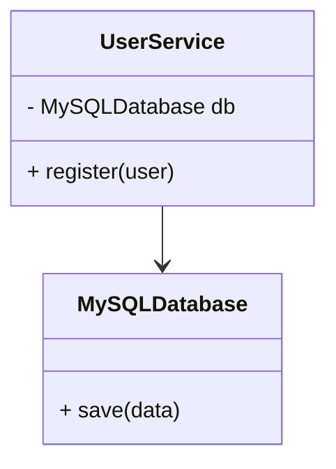
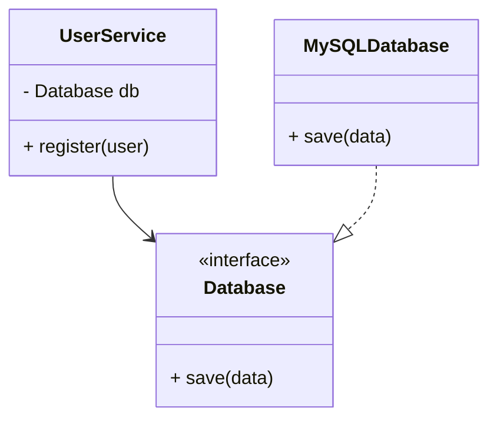
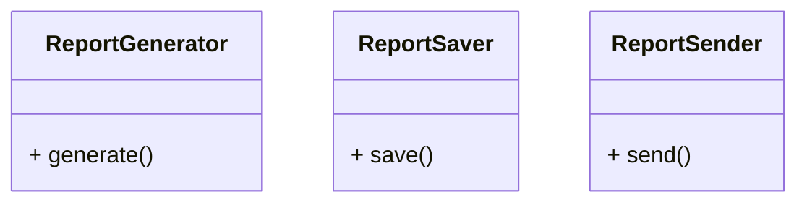
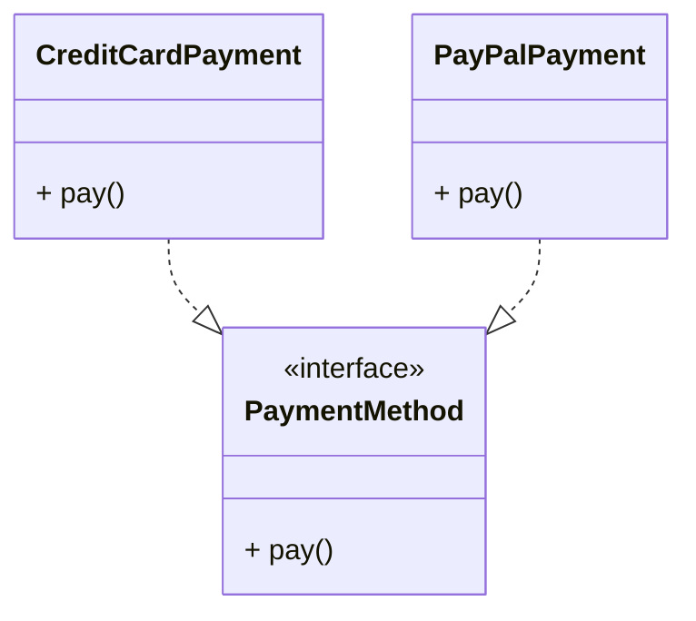
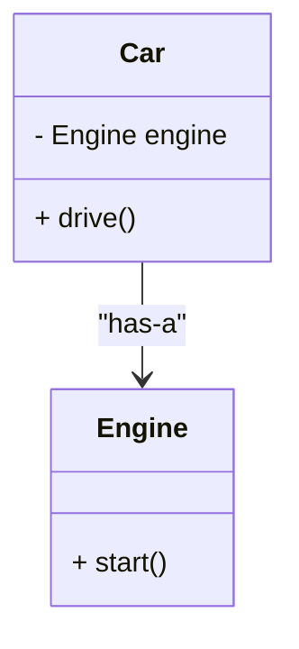
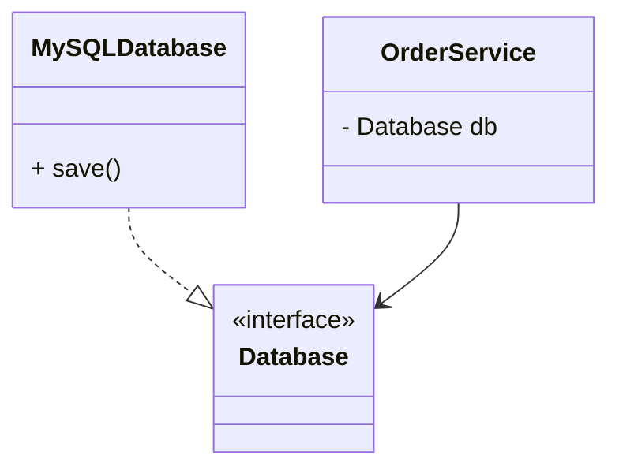
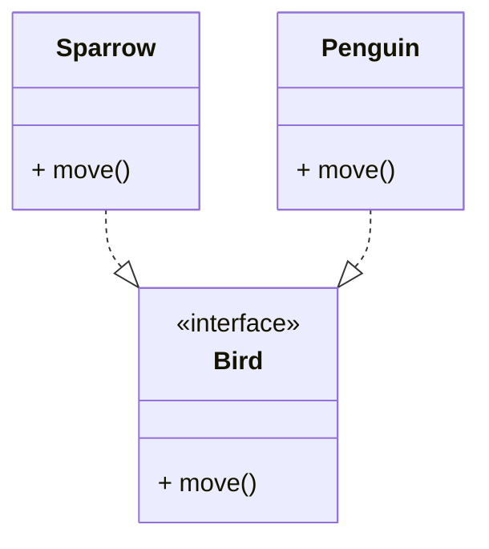
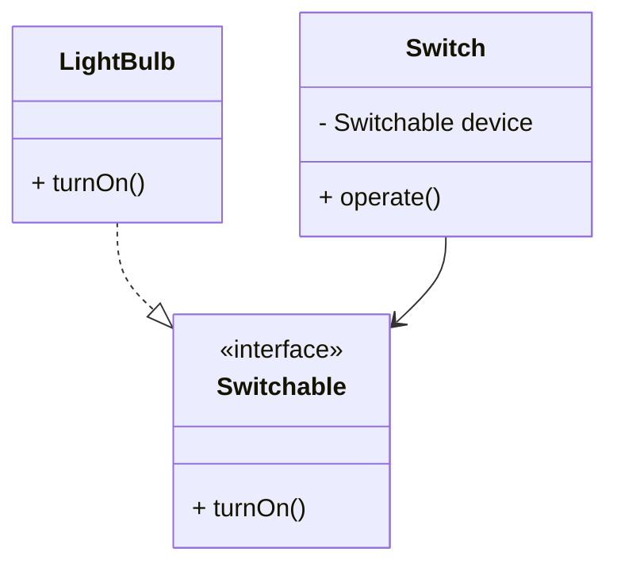

# Java – Modélisation Objet et Principes SOLID

## Objectif du cours

Apprendre à concevoir des modèles objets en Java en appliquant les **principes SOLID**, afin de créer du code modulaire, extensible, et testable.

---

## 1. Couplage faible et couplage fort

### Exemple Java

```java
// Couplage fort : dépendance directe
class MySQLDatabase {
    public void save(String data) {
        System.out.println("Saving to MySQL: " + data);
    }
}

class UserService {
    private MySQLDatabase db = new MySQLDatabase(); // dépendance forte
    public void register(String user) {
        db.save(user);
    }
}
```

```java
// Couplage faible : dépendance à une abstraction
interface Database {
    void save(String data);
}

class MySQLDatabase implements Database {
    public void save(String data) { System.out.println("Saving to MySQL: " + data); }
}

class UserService {
    private Database db;
    public UserService(Database db) { this.db = db; } // injection
    public void register(String user) { db.save(user); }
}
```

### Diagramme Mermaid





---

## 2. Principe de Responsabilité Unique (SRP)

### Exemple Java

```java
// Mauvais : une seule classe fait trop de choses
class Report {
    void generateReport() {}
    void saveToFile() {}
    void sendByEmail() {}
}
```

```java
// Bon : séparation des responsabilités
class ReportGenerator { void generate() {} }
class ReportSaver { void save() {} }
class ReportSender { void send() {} }
```

### Diagramme Mermaid



---

## 3. Principe Ouvert/Fermé (OCP)

### Exemple Java

```java
// Mauvais : modification obligatoire
class Payment {
    void pay(String method) {
        if (method.equals("credit")) { /* ... */ }
        else if (method.equals("paypal")) { /* ... */ }
    }
}
```

```java
// Bon : extension via interface
interface PaymentMethod { void pay(); }

class CreditCardPayment implements PaymentMethod {
    public void pay() { System.out.println("Paiement carte"); }
}

class PayPalPayment implements PaymentMethod {
    public void pay() { System.out.println("Paiement PayPal"); }
}
```

### Diagramme Mermaid



---

## 4. Composition vs Héritage

### Exemple Java

```java
// Mauvais : héritage
class Engine {}
class Car extends Engine {} // une voiture n'est pas un moteur
```

```java
// Bon : composition
class Engine {}
class Car {
    private Engine engine;
    public Car(Engine engine) { this.engine = engine; }
}
```

### Diagramme Mermaid



---

## 5. Dépendance aux Interfaces

### Exemple Java

```java
// Mauvais
class OrderService {
    private MySQLDatabase db = new MySQLDatabase();
}
```

```java
// Bon
class OrderService {
    private Database db;
    public OrderService(Database db) { this.db = db; }
}
```

### Diagramme Mermaid



---

## 6. Principe de Substitution de Liskov (LSP)

### Exemple Java

```java
// Violation
class Bird {
    void fly() {}
}

class Penguin extends Bird {
    void fly() { throw new UnsupportedOperationException(); }
}
```

```java
// Correction
interface Bird { void move(); }

class Sparrow implements Bird {
    public void move() { System.out.println("Le moineau vole"); }
}

class Penguin implements Bird {
    public void move() { System.out.println("Le pingouin nage"); }
}
```

### Diagramme Mermaid



---

## 7. Principe d’Inversion de Dépendance (DIP)

### Exemple Java

```java
// Violation
class LightBulb {
    void turnOn() { System.out.println("On"); }
}

class Switch {
    private LightBulb bulb = new LightBulb();
    void operate() { bulb.turnOn(); }
}
```

```java
// Respect
interface Switchable { void turnOn(); }

class LightBulb implements Switchable {
    public void turnOn() { System.out.println("On"); }
}

class Switch {
    private Switchable device;
    public Switch(Switchable device) { this.device = device; }
    void operate() { device.turnOn(); }
}
```

### Diagramme Mermaid



---

## Conclusion

* Les principes **SOLID** permettent d’obtenir du code clair, extensible et testable.
* La **composition** doit être privilégiée sur l’héritage.
* Il est essentiel de programmer contre des **interfaces** et non contre des implémentations concrètes.

--
