# Java – Modélisation Objet et Principes SOLID


## Objectif du cours

Apprendre à concevoir des modèles objets en Java en appliquant les **principes SOLID**, afin de produire du code :

* **modulaire** (chaque composant peut évoluer indépendamment),
* **extensible** (ouvert aux ajouts de fonctionnalités sans casser l’existant),
* **testable** (facile à valider grâce à la séparation claire des responsabilités).


# 1. Couplage faible et couplage fort

Le **couplage** désigne la dépendance entre deux classes.

* **Couplage fort** : une classe dépend directement d’une autre implémentation concrète. Cela rigidifie le système, car un changement dans une classe implique souvent une modification dans l’autre.
* **Couplage faible** : une classe dépend uniquement d’une abstraction (interface ou classe abstraite). Cela rend le code plus flexible et plus facile à maintenir.

En pratique, le couplage faible est atteint par :

1. L’utilisation d’**interfaces**.
2. L’**injection de dépendances** (via le constructeur ou un framework comme Spring).


### Exemple en Java

#### Cas de **couplage fort**

```java
// Classe dépendante d’une implémentation concrète
class MySQLDatabase {
    public void save(String data) {
        System.out.println("Saving to MySQL: " + data);
    }
}

class UserService {
    private MySQLDatabase db = new MySQLDatabase(); // dépendance forte

    public void register(String user) {
        db.save(user);
    }
}
```

➡ Ici, `UserService` est **lié en dur** à `MySQLDatabase`.
Si demain on souhaite remplacer la base de données par PostgreSQL, il faut **modifier la classe UserService**, ce qui brise l’extensibilité.


#### Cas de **couplage faible**

```java
// Définition d’une abstraction
interface Database {
    void save(String data);
}

// Implémentation concrète
class MySQLDatabase implements Database {
    public void save(String data) {
        System.out.println("Saving to MySQL: " + data);
    }
}

// Service qui dépend de l’abstraction
class UserService {
    private Database db;

    public UserService(Database db) { // injection via le constructeur
        this.db = db;
    }

    public void register(String user) {
        db.save(user);
    }
}
```

➡ Ici, `UserService` dépend uniquement de l’**interface `Database`**.
On peut injecter n’importe quelle implémentation (`MySQLDatabase`, `PostgreSQLDatabase`, `MockDatabase` pour les tests, etc.) sans toucher au code du service.

C’est ce qu’on appelle un **code extensible et testable**.


### Représentation 

#### Couplage fort


➡ `UserService` est directement reliée à `MySQLDatabase`. Le lien est **rigide**.


#### Couplage faible


➡ `UserService` dépend de l’interface `Database`. L’implémentation (`MySQLDatabase`) est interchangeable, ce qui favorise la **flexibilité** et la **maintenabilité**.


<br/>
<br/>


# 2. Principe de Responsabilité Unique (SRP)

Le principe de **responsabilité unique** stipule qu’une classe ne doit avoir **qu’une seule raison de changer**.
En d’autres termes, chaque classe doit se concentrer sur **une seule tâche bien définie**.

* Si une classe gère plusieurs responsabilités (ex. génération, sauvegarde et envoi d’un rapport), elle devient plus difficile à maintenir.
* En cas de modification dans l’un des aspects (ex. format du rapport, méthode de stockage ou protocole d’envoi), la classe risque d’être modifiée à plusieurs endroits, ce qui augmente le risque d’erreurs.


### Exemple Java

#### Mauvaise pratique : plusieurs responsabilités dans une seule classe

```java
class Report {
    void generateReport() {
        // Génération du contenu
    }
    void saveToFile() {
        // Sauvegarde sur disque
    }
    void sendByEmail() {
        // Envoi par email
    }
}
```

➡ Ici, la classe `Report` fait **trop de choses à la fois**.
Elle est responsable à la fois de la génération, de la sauvegarde et de l’envoi.
Un changement dans la logique d’envoi par email pourrait casser la génération ou la sauvegarde.


#### Bonne pratique : séparation claire des responsabilités

```java
class ReportGenerator {
    void generate() {
        // Génération du contenu
    }
}

class ReportSaver {
    void save() {
        // Sauvegarde sur disque
    }
}

class ReportSender {
    void send() {
        // Envoi par email
    }
}
```

➡ Chaque classe est responsable d’une seule fonctionnalité.
Cela facilite les tests unitaires (on peut tester `ReportSaver` indépendamment de `ReportSender`) et rend le code **plus clair et plus maintenable**.


### Diagramme Mermaid


➡ Le diagramme illustre la **séparation des rôles** : trois classes simples, chacune focalisée sur une responsabilité unique.


<br/>
<br/>

# 3. Principe Ouvert/Fermé (OCP)

Le principe **Ouvert/Fermé** stipule qu’un module (classe, fonction, composant) doit être :

* **Ouvert à l’extension** → on peut ajouter de nouveaux comportements.
* **Fermé à la modification** → on ne modifie pas le code existant lorsqu’on introduit un nouveau cas d’utilisation.

Ce principe vise à éviter d’altérer du code déjà validé et testé, afin de réduire les risques de régressions.
En pratique, il est souvent mis en œuvre grâce aux **interfaces** et au **polymorphisme**.


### Exemple Java

#### Mauvaise pratique : modification obligatoire

```java
class Payment {
    void pay(String method) {
        if (method.equals("credit")) {
            // Paiement par carte
            System.out.println("Paiement par carte bancaire");
        } else if (method.equals("paypal")) {
            // Paiement par PayPal
            System.out.println("Paiement via PayPal");
        }
    }
}
```

➡ Ici, si l’on veut ajouter un nouveau mode de paiement (ex. **Bitcoin**, **Apple Pay**), il faut **modifier la classe Payment** et rajouter de nouvelles conditions.
Cela va à l’encontre du principe OCP, car on altère du code déjà en production.


#### Bonne pratique : extension via interface

```java
interface PaymentMethod {
    void pay();
}

class CreditCardPayment implements PaymentMethod {
    public void pay() {
        System.out.println("Paiement par carte bancaire");
    }
}

class PayPalPayment implements PaymentMethod {
    public void pay() {
        System.out.println("Paiement via PayPal");
    }
}

class PaymentProcessor {
    private PaymentMethod method;

    public PaymentProcessor(PaymentMethod method) {
        this.method = method;
    }

    public void process() {
        method.pay();
    }
}
```

➡ Ici, `PaymentProcessor` n’a pas besoin de connaître les détails des implémentations.
On peut ajouter **BitcoinPayment**, **ApplePayPayment**, etc., **sans modifier le code existant**.
On se contente d’écrire une nouvelle classe qui implémente `PaymentMethod`.

---

### Diagramme Mermaid

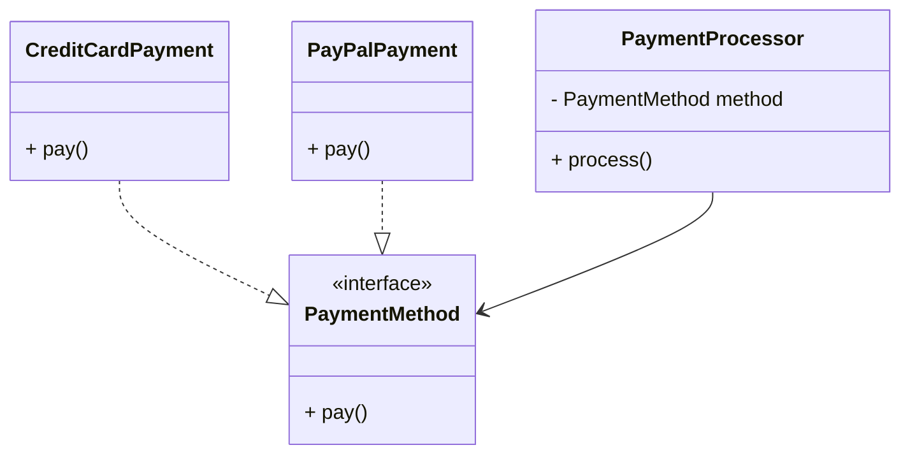

➡ Le diagramme montre que `PaymentProcessor` dépend de l’**abstraction** `PaymentMethod`, et non des implémentations concrètes.
Ainsi, on peut enrichir le système avec de nouveaux paiements sans modifier le cœur du code.


<br/>
<br/>


# 4. Composition vs Héritage

En POO, choisir entre **héritage (is-a)** et **composition (has-a)** conditionne la flexibilité et la maintenabilité du design.

* Utilise **l’héritage** quand la relation est une véritable spécialisation stable (ex. `ElectricCar` est une `Car`).
* Privilégie **la composition** quand un objet a besoin d’un autre pour fonctionner (ex. `Car` possède un `Engine`).
  La composition favorise l’extension (OCP), les tests, et évite les hiérarchies fragiles.

### Exemple Java — héritage inapproprié (à éviter)

```java
// Mauvais : une voiture n'est PAS un moteur
class Engine {
    void start() { System.out.println("Start engine"); }
}
class Car extends Engine {        // erreur de modélisation : Car "est un" Engine
    void drive() { start(); System.out.println("Driving"); }
}
```

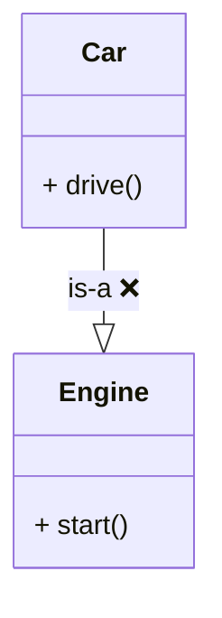

➡ Ici, toute évolution du moteur impose de toucher à la hiérarchie. Le modèle est conceptuellement faux.

### Exemple Java — composition correcte (recommandé)

```java
// Bon : Car "a un" Engine
interface Engine { void start(); }

class DieselEngine implements Engine {
    public void start() { System.out.println("Diesel start"); }
}
class ElectricEngine implements Engine {
    public void start() { System.out.println("Electric start"); }
}

class Car {
    private final Engine engine;          // dépendance à l'abstraction
    public Car(Engine engine) { this.engine = engine; } // injection

    public void drive() {
        engine.start();
        System.out.println("Driving");
    }
}
```

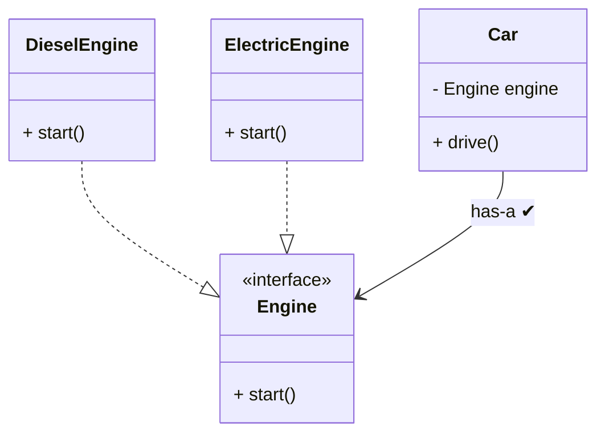

➡ `Car` dépend d’une **abstraction**. On peut ajouter `HybridEngine` sans modifier `Car` (OCP).

### Variantes usuelles de composition (agrégation vs composition forte)

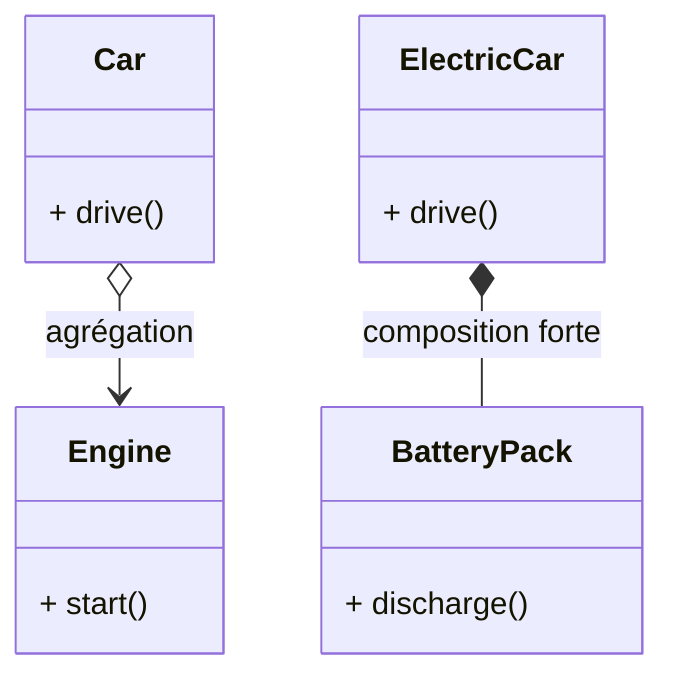

➡ Utilise la **composition forte** lorsque le cycle de vie de la partie est lié à l’ensemble.

### Injection de dépendances (constructeur, setter, fabrique)

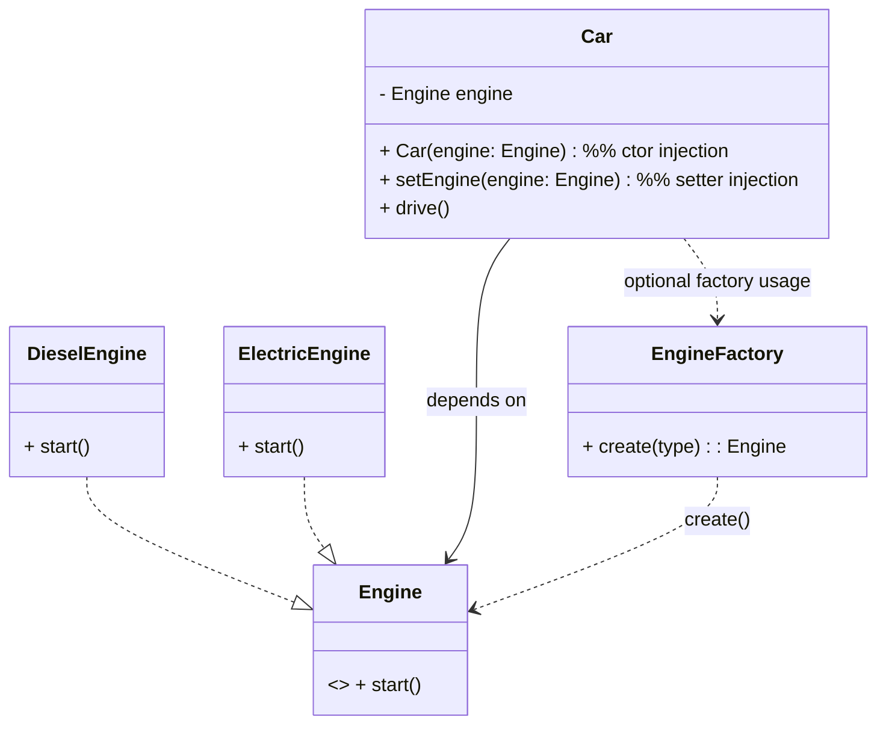

➡ Choisis l’injection **par constructeur** par défaut (dépendance immuable, plus testable).

### Séquence d’exécution (vue comportement)

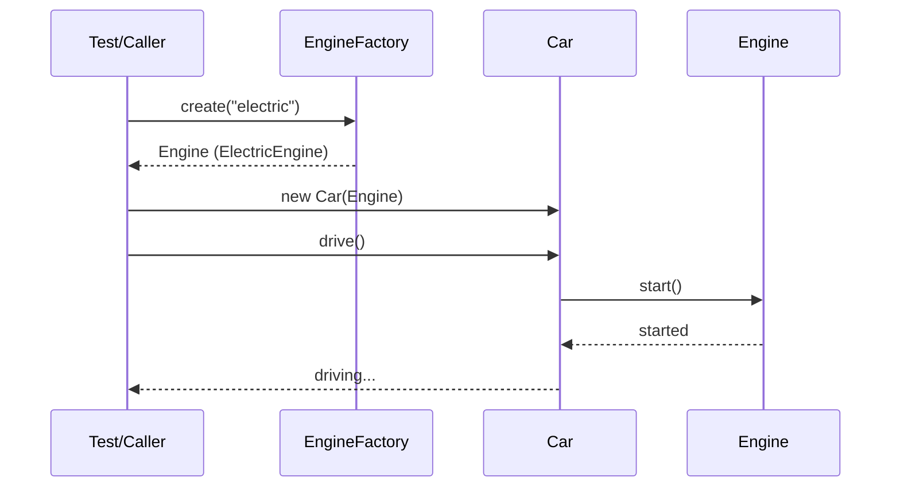

➡ La séquence montre l’injection (via fabrique ou non) et la délégation de `Car` vers `Engine`.

### Anti-patterns fréquents (à repérer)

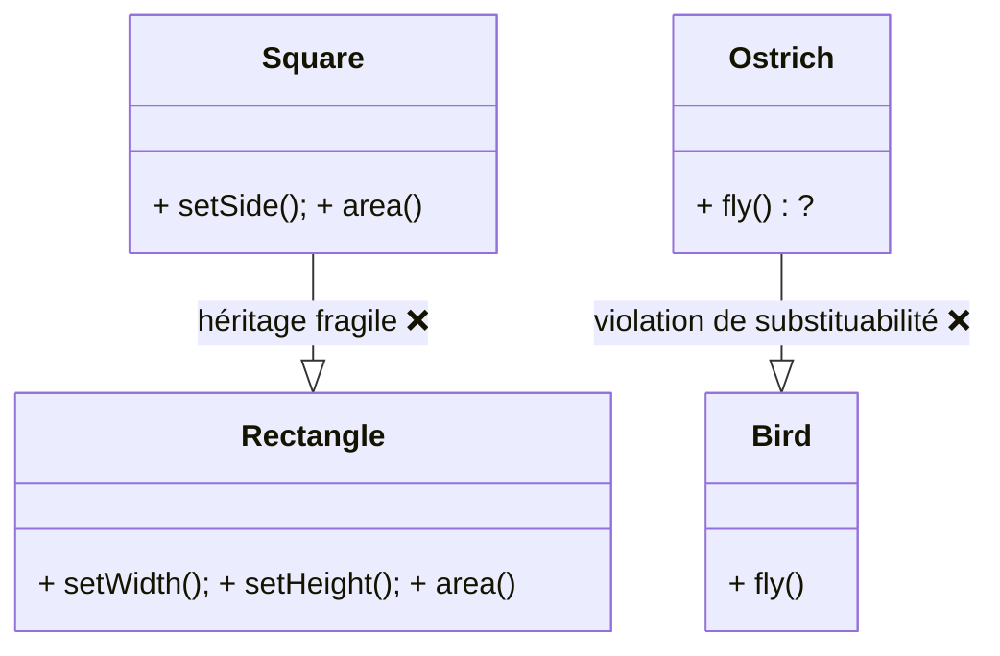

➡ Quand l’héritage affaiblit l’**invariant** ou force des méthodes non pertinentes, préfère **composition + stratégies**.

### Stratégies de comportement (composition + polymorphisme)

```java
interface DrivingMode { void move(); }
class EcoMode implements DrivingMode { public void move() { System.out.println("Eco"); } }
class SportMode implements DrivingMode { public void move() { System.out.println("Sport"); } }

class Car {
    private final Engine engine;
    private DrivingMode mode;
    public Car(Engine engine, DrivingMode mode) { this.engine = engine; this.mode = mode; }
    public void setMode(DrivingMode mode) { this.mode = mode; }
    public void drive() { engine.start(); mode.move(); }
}
```

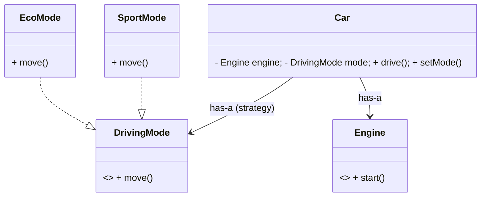

➡ La **composition de stratégies** évite l’explosion de sous-classes (`SportElectricCar`, `EcoDieselCar`, etc.).

### Récap visuel (checklist de décision)

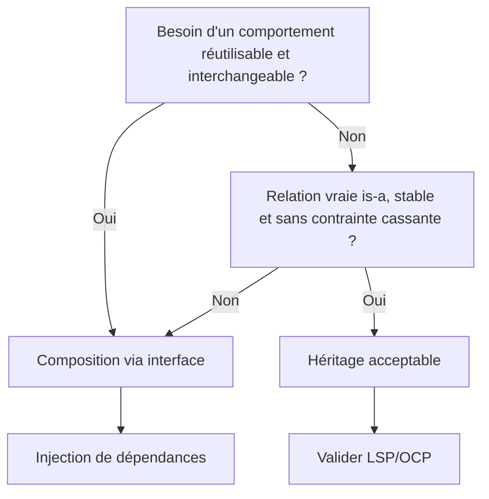

➡ Par défaut, commence par **composition**. N’emploie l’héritage que si la relation **is-a** est solide et respecte LSP.


## 5. Dépendance aux Interfaces

### Exemple Java

```java
// Mauvais
class OrderService {
    private MySQLDatabase db = new MySQLDatabase();
}
```

```java
// Bon
class OrderService {
    private Database db;
    public OrderService(Database db) { this.db = db; }
}
```

### Diagramme 


<br/>
<br/>


# 6. Principe de Substitution de Liskov (LSP)

Le principe de **substitution de Liskov** impose que toute classe fille puisse se substituer à sa classe mère sans altérer la cohérence du programme.
Autrement dit : si `S` hérite de `T`, alors partout où l’on attend un `T`, on doit pouvoir utiliser un `S` **sans comportement inattendu**.

### Exemple Java — Violation

```java
// Violation du LSP : Penguin hérite de Bird mais ne vole pas
class Bird {
    void fly() { System.out.println("L'oiseau vole"); }
}

class Penguin extends Bird {
    void fly() { throw new UnsupportedOperationException(); }
}
```

➡ Ici, `Penguin` hérite de `Bird`, mais redéfinit `fly()` pour lever une exception.
Le code devient fragile : tout appel polymorphique sur un `Bird` peut échouer si l’instance est un `Penguin`.

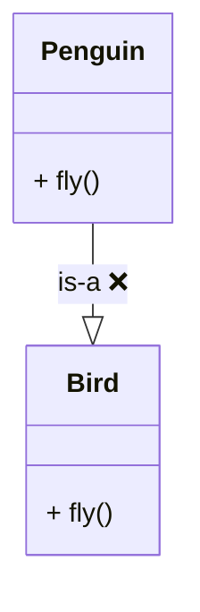


### Exemple Java — Correction

```java
// Respect du LSP : définir une abstraction correcte
interface Bird { void move(); }

class Sparrow implements Bird {
    public void move() { System.out.println("Le moineau vole"); }
}

class Penguin implements Bird {
    public void move() { System.out.println("Le pingouin nage"); }
}
```

➡ Chaque oiseau implémente le contrat `move()`, mais avec un comportement cohérent à sa nature.
Ainsi, on ne casse jamais les attentes du client.


### Séquence de substitution correcte

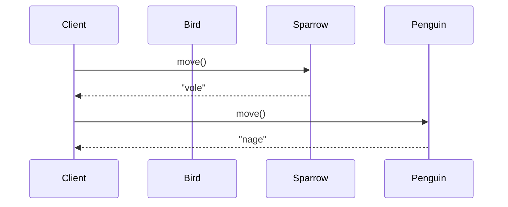

➡ Le client n’a pas à connaître le type concret. Il utilise simplement l’interface `Bird`.
Le contrat est respecté dans tous les cas : pas d’exception inattendue.


# 7. Principe d’Inversion de Dépendance (DIP)

Le principe d’**inversion de dépendance** stipule que :

* Les **modules de haut niveau** (logique métier) ne doivent pas dépendre des **modules de bas niveau** (implémentations concrètes).
* Les deux doivent dépendre d’**abstractions** (interfaces).
* Les abstractions ne doivent pas dépendre des détails, ce sont les détails qui dépendent des abstractions.


### Exemple Java — Violation

```java
class LightBulb {
    void turnOn() { System.out.println("Ampoule allumée"); }
}

class Switch {
    private LightBulb bulb = new LightBulb();
    void operate() { bulb.turnOn(); }
}
```

➡ Ici, `Switch` dépend directement de `LightBulb`.
Impossible de réutiliser le code avec une autre source lumineuse (`LED`, `Projecteur`) sans modifier `Switch`.

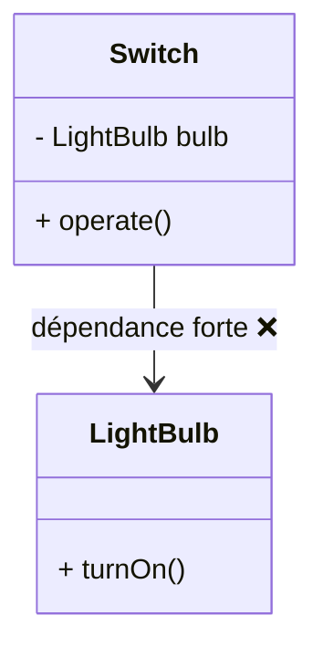


### Exemple Java — Respect du DIP

```java
interface Switchable { void turnOn(); }

class LightBulb implements Switchable {
    public void turnOn() { System.out.println("Ampoule allumée"); }
}

class Fan implements Switchable {
    public void turnOn() { System.out.println("Ventilateur en marche"); }
}

class Switch {
    private Switchable device;
    public Switch(Switchable device) { this.device = device; }
    void operate() { device.turnOn(); }
}
```

➡ `Switch` ne dépend plus de `LightBulb`, mais de l’**abstraction `Switchable`**.
On peut brancher une ampoule, un ventilateur, ou tout autre appareil sans modifier `Switch`.

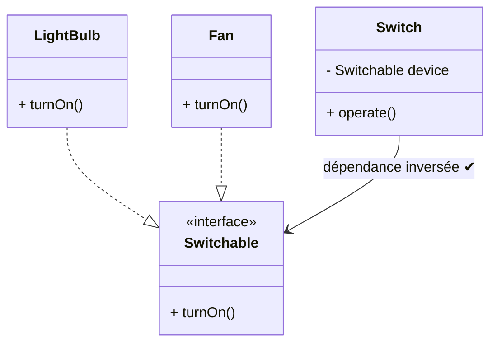


### Séquence d’utilisation

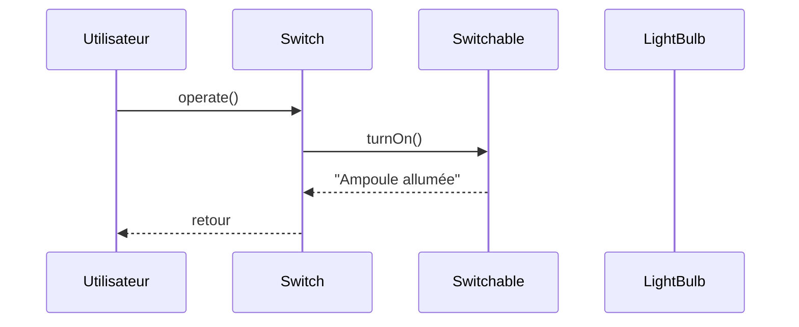

➡ Le **client** (l’utilisateur) ne sait pas quel appareil est contrôlé : il n’utilise que l’abstraction.


## Conclusion

* Les principes **SOLID** permettent d’obtenir du code clair, extensible et testable.
* La **composition** doit être privilégiée sur l’héritage.
* Il est essentiel de programmer contre des **interfaces** et non contre des implémentations concrètes.

--
