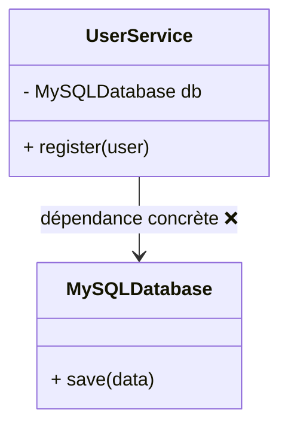
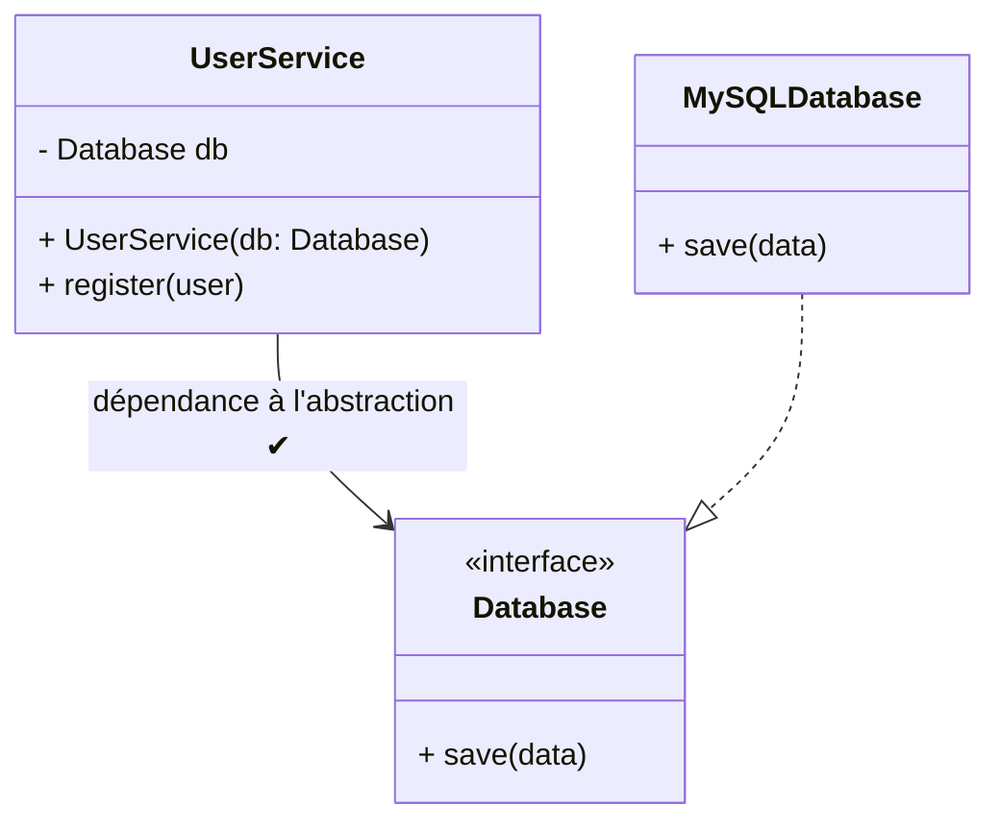
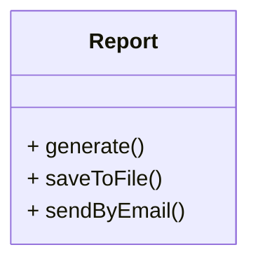
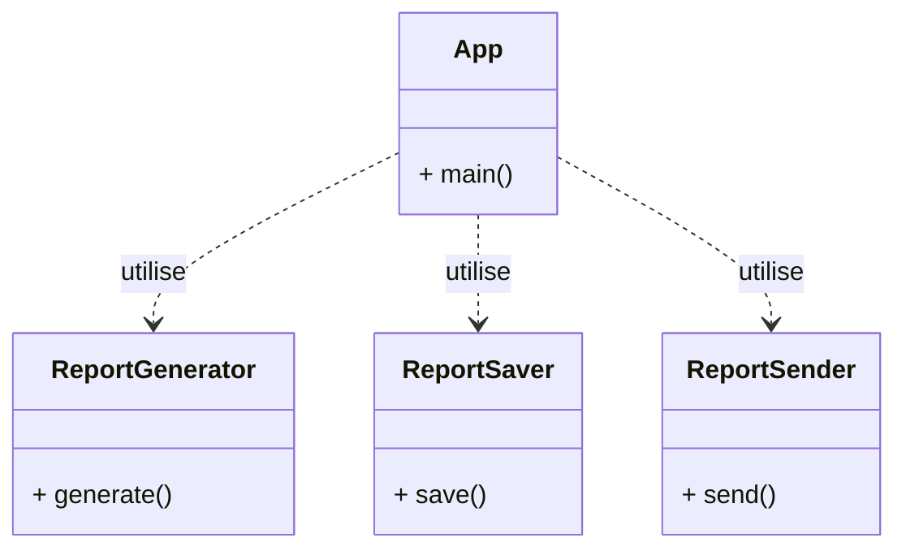
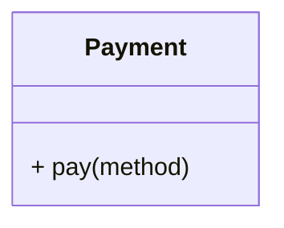
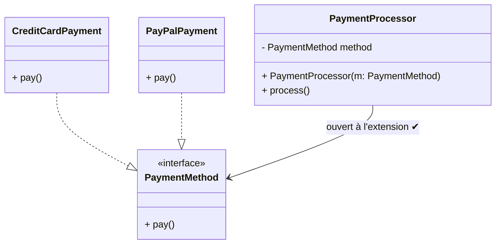
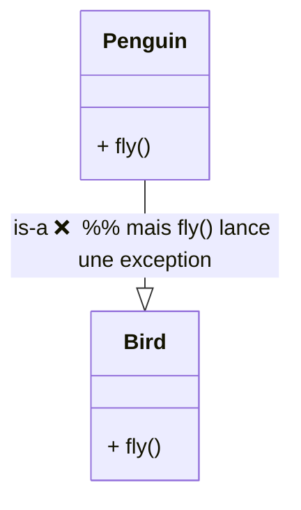
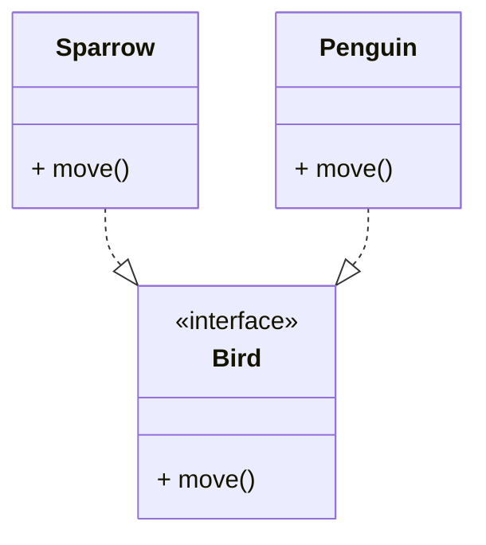
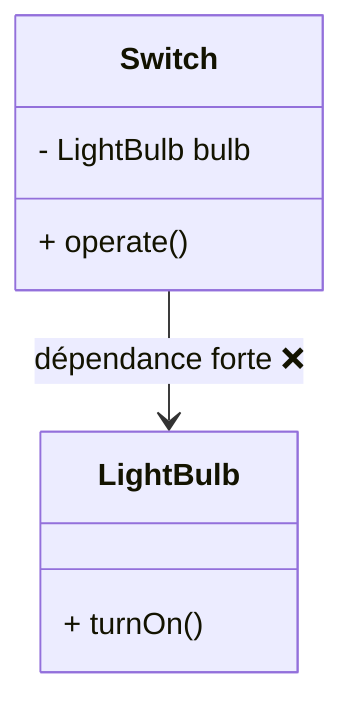
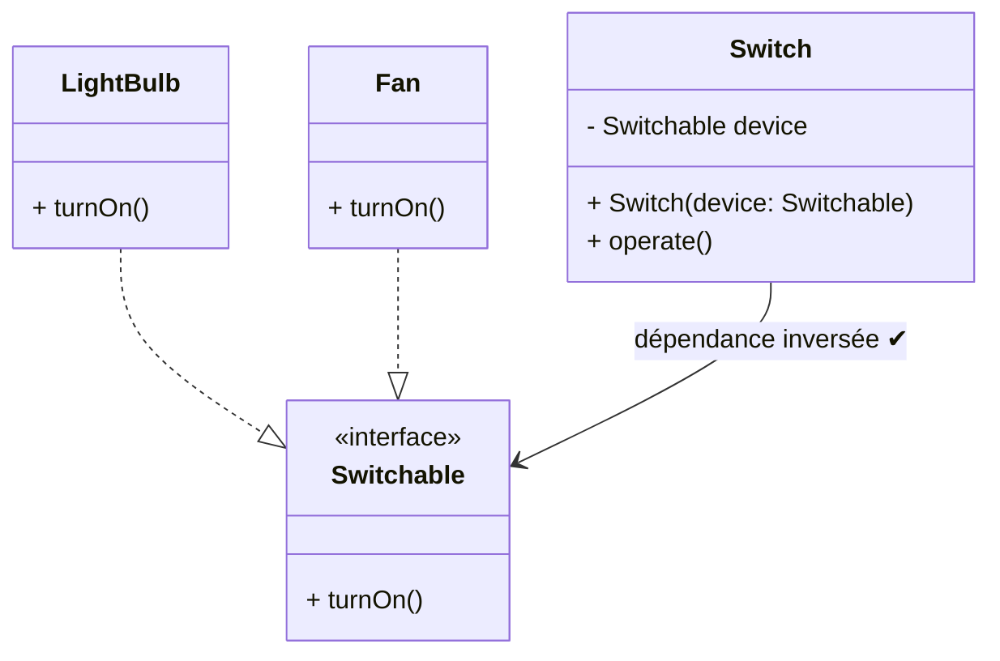

## Exercice 1 — Couplage fort

**Mauvaise pratique (à corriger vers interface + injection)**

```java
class MySQLDatabase {
    void save(String data) { System.out.println("MySQL: " + data); }
}

class UserService {
    private MySQLDatabase db = new MySQLDatabase(); // couplage fort

    void register(String user) {
        db.save(user);
    }

    public static void main(String[] args) {
        new UserService().register("alice");
    }
}
```

**À faire :** 
1. créer `interface Database`
2. implémentation `MySQLDatabase` classe concrête de l'interface `interface Database`.
3. implémentation d'une autre classe concrête, par exemple, `InMemoryDatabase` , deuxième classe concrête de l'interface `interface Database`.
4. injecter `Database` via le constructeur de `UserService`.
5. Créer la classe principale App.java pour tester la nouvelle classe `UserService` qui présente un couplage moins fort.


## Correction Exercice 1 — Version simple


### Diagramme des dépendances 

```
                  +------------------+
                  |   Database (I)   |<----------------------+
                  +------------------+                       |
                          ^                                   |
                          |                                   |
           +--------------+---------------+                   |
           |                              |                   |
+-----------------------+     +-----------------------+       |
| MySQLDatabase (impl.) |     | InMemoryDatabase (impl)|       |
+-----------------------+     +-----------------------+       |
                                                               |
                             +--------------------+            |
                             |    UserService     |------------+
                             +--------------------+
                                      ^
                                      |
                                      |  Injected at runtime
                                      |
                             +--------------------+
                             |       App          |
                             +--------------------+
```


## Arboresance du projet VScode 

```java
C:.
├───.vscode
├───bin
├───lib
└───src
        App.java
        Database.java
        InMemoryDatabase.java
        MySQLDatabase.java
        UserService.java

```


##  Étape 1 - Création de l'interface Database

```java
public interface Database {
    void save(String data);
}
```

##  Étape 2 - Création de deux implémentations concrêtes de l'interface Database

#### Implémentation 1 - MySQLDatabase (Étape 2)

```java
public class MySQLDatabase implements Database {

   @Override
    public void save(String data) {
        // Simulation d’une insertion en base réelle
        System.out.println("MySQL: " + data);
    }
    
}
```

#### Implémentation 2 - InMemoryDatabase (Étape 3)

```java
import java.util.ArrayList;
import java.util.List;

public class InMemoryDatabase implements Database{

  private final List<String> storage = new ArrayList<>();

    @Override
    public void save(String data) {
        storage.add(data);
        System.out.println("InMemoryDB saved: " + data);
    }

    // Méthode utilitaire pour consulter l’état interne
    public List<String> getStorage() {
        return storage;
    }
    
}

```


## Étape 4  - injecter `Database` via le constructeur de `UserService`.

```java
public class UserService {
    private final Database db; // dépend de l’abstraction, pas d’une classe concrète

    // Injection via le constructeur (obligatoire et sûr)
    public UserService(Database db) {
        if (db == null) {
            throw new IllegalArgumentException("Database ne peut pas être null");
        }
        this.db = db;
    }

    public void register(String user) {
        // Ici on pourrait valider / transformer l’utilisateur
        db.save(user);
    }
}


```


## Étape 5 - Créer la classe principale App.java pour tester la nouvelle classe `UserService` qui présente un couplage moins fort.

```java
public class App {
    public static void main(String[] args) throws Exception {
        
        String user1    = "Alice";

        InMemoryDatabase db1 = new InMemoryDatabase();
        MySQLDatabase db2 = new MySQLDatabase();

        UserService service = new UserService(db2);
        service.register(user1); 

    }
}

```


## Exécutez le code !!!!

```java
C:.
├───.vscode
├───bin
├───lib
└───src
        App.java
        Database.java
        InMemoryDatabase.java
        MySQLDatabase.java
        UserService.java

```
---

## Exercice 2 — SRP (trop de responsabilités)

**Mauvaise pratique (à découper en 3 classes)**

```java
class Report {
    void generate() { System.out.println("gen"); }
    void saveToFile() { System.out.println("save"); }
    void sendByEmail() { System.out.println("email"); }

    public static void main(String[] args) {
        Report r = new Report();
        r.generate();
        r.saveToFile();
        r.sendByEmail();
    }
}
```

**À faire :** créer `ReportGenerator`, `ReportSaver`, `ReportSender`. La méthode `main` orchestre les trois.

---

## Exercice 3 — OCP (if/else sur le type)

**Mauvaise pratique (à transformer en polymorphisme)**

```java
class Payment {
    void pay(String method) {
        if ("credit".equals(method)) {
            System.out.println("Carte");
        } else if ("paypal".equals(method)) {
            System.out.println("PayPal");
        } else if ("cash".equals(method)) {
            System.out.println("Espèces");
        } else {
            throw new IllegalArgumentException("inconnu");
        }
    }

    public static void main(String[] args) {
        new Payment().pay("credit");
    }
}
```

**À faire :** créer `interface PaymentMethod { void pay(); }`, implémentations (`CreditCardPayment`, `PayPalPayment`, …) et un `PaymentProcessor` qui reçoit un `PaymentMethod`.

---

## Exercice 4 — LSP (contrat cassé)

**Mauvaise pratique (à corriger vers un contrat commun cohérent)**

```java
class Bird {
    void fly() { System.out.println("vole"); }
}

class Penguin extends Bird {
    @Override
    void fly() { throw new UnsupportedOperationException(); } // casse le contrat
}

public class Main {
    public static void main(String[] args) {
        Bird b1 = new Bird();
        Bird b2 = new Penguin();
        b1.fly();
        b2.fly(); // crash
    }
}
```

**À faire :** remplacer par `interface Bird { void move(); }`, puis `Sparrow.move()` → “vole”, `Penguin.move()` → “nage”. Le `main` ne doit plus planter.

---

## Exercice 5 — DIP (dépendance aux détails)

**Mauvaise pratique (à inverser vers abstraction)**

```java
class LightBulb {
    void turnOn() { System.out.println("On"); }
}

class Switch {
    private LightBulb bulb = new LightBulb(); // dépendance concrète

    void operate() { bulb.turnOn(); }

    public static void main(String[] args) {
        new Switch().operate();
    }
}
```

**À faire :** créer `interface Switchable { void turnOn(); }`, faire implémenter `LightBulb`, modifier `Switch` pour recevoir un `Switchable` par constructeur. Ajouter `Fan` sans toucher `Switch`.


# Annexe – Digrammes


## Exercice 1 — Couplage fort → Couplage faible (interfaces + injection)

**Avant (couplage fort)**



**Après (interface + injection)**



<br/>

## Exercice 2 — SRP : une classe “fourre-tout” → 3 classes simples

**Avant (trop de responsabilités)**



**Après (séparation claire)**



<br/>

## Exercice 3 — OCP : if/else par type → polymorphisme

**Avant (if/else qui grossit)**



**Après (interface + implémentations)**



<br/>

## Exercice 4 — LSP : sous-classe qui casse le contrat → contrat commun correct

**Avant (violation LSP)**



**Après (contrat cohérent pour tous)**




<br/>

## Exercice 5 — DIP : dépendance aux détails → dépendance aux abstractions

**Avant (dépendance concrète)**



**Après (interface + injection + nouveaux appareils)**




