## Objectif du cours

But : écrire du code **modulaire**, **extensible** et **testable** en Java grâce aux **principes SOLID**.

---

# 1. Couplage faible et couplage fort

**Idée simple :**

* **Fort** = dépend d’une classe concrète → rigide.
* **Faible** = dépend d’une **interface** → flexible.

### Exemple Java — couplage fort (à éviter)

```java
class MySQLDatabase {
    public void save(String data) { System.out.println("Saving to MySQL: " + data); }
}

class UserService {
    private MySQLDatabase db = new MySQLDatabase(); // dépendance forte
    public void register(String user) { db.save(user); }
}
```

➡ Problème : si la BD change, il faut modifier `UserService`.

### Exemple Java — couplage faible (recommandé)

```java
interface Database { void save(String data); }

class MySQLDatabase implements Database {
    public void save(String data) { System.out.println("Saving to MySQL: " + data); }
}

class UserService {
    private Database db; // dépend de l'interface
    public UserService(Database db) { this.db = db; } // injection
    public void register(String user) { db.save(user); }
}
```

➡ Avantage : on peut remplacer la BD sans toucher `UserService`.

### Diagrammes

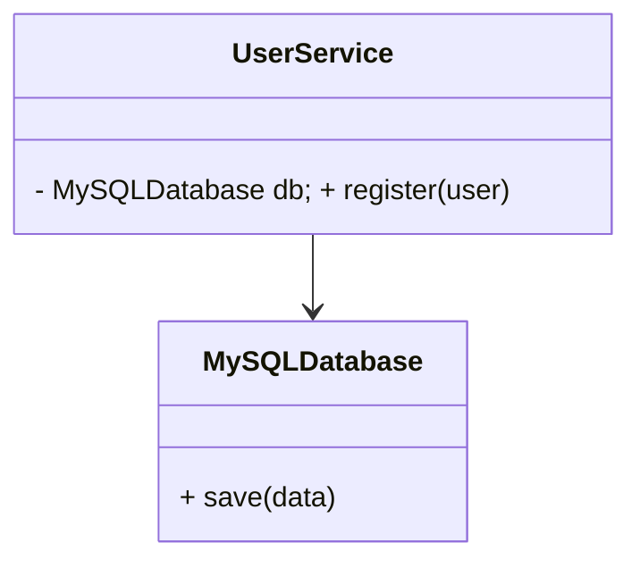

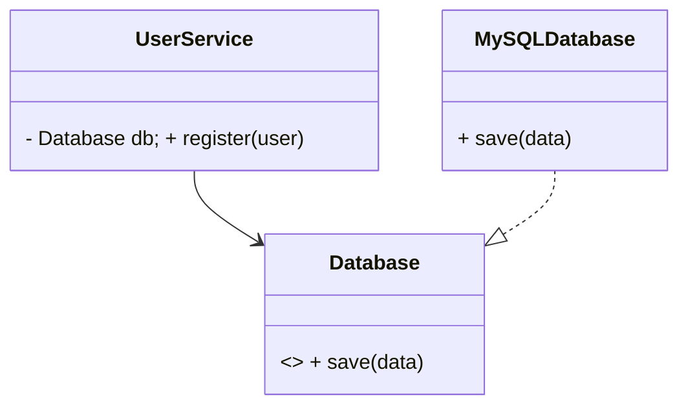

---

# 2. Principe de Responsabilité Unique (SRP)

**Idée simple :** une classe = **une seule** responsabilité.

### Mauvaise pratique

```java
class Report {
    void generateReport() {}
    void saveToFile() {}
    void sendByEmail() {}
}
```

➡ Trop de rôles dans une seule classe.

### Bonne pratique

```java
class ReportGenerator { void generate() {} }
class ReportSaver    { void save() {} }
class ReportSender   { void send() {} }
```

➡ Simple à tester et à faire évoluer.

### Diagramme

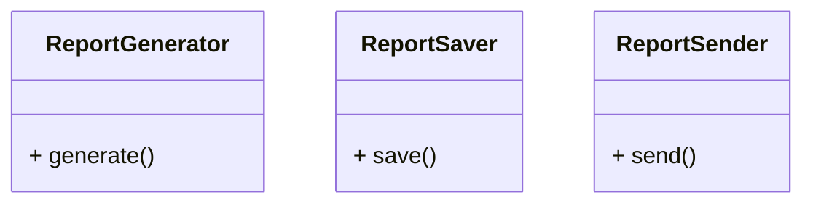

---

# 3. Principe Ouvert/Fermé (OCP)

**Idée simple :** **ajouter** du code (nouvelles classes) plutôt que **modifier** l’existant.

### Mauvaise pratique

```java
class Payment {
    void pay(String method) {
        if (method.equals("credit")) { System.out.println("Carte"); }
        else if (method.equals("paypal")) { System.out.println("PayPal"); }
    }
}
```

➡ À chaque nouveau moyen de paiement, on modifie `Payment`.

### Bonne pratique

```java
interface PaymentMethod { void pay(); }

class CreditCardPayment implements PaymentMethod {
    public void pay() { System.out.println("Carte"); }
}
class PayPalPayment implements PaymentMethod {
    public void pay() { System.out.println("PayPal"); }
}

class PaymentProcessor {
    private PaymentMethod method;
    public PaymentProcessor(PaymentMethod method) { this.method = method; }
    public void process() { method.pay(); }
}
```

➡ On **ajoute** une classe `BitcoinPayment` sans toucher au reste.

### Diagramme

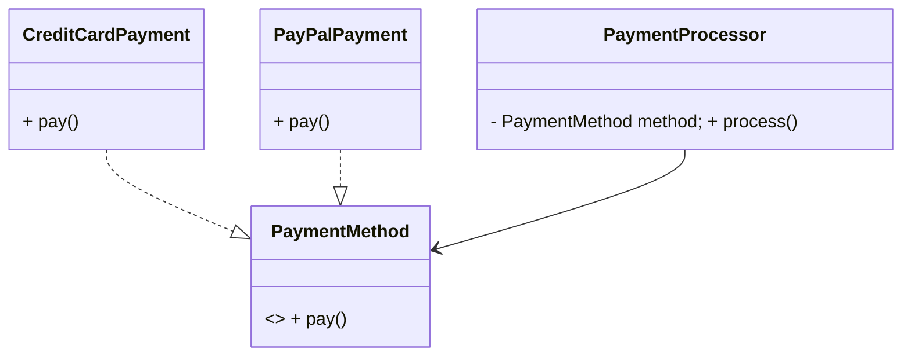

---

# 4. Composition vs Héritage

**Idée simple :**

* **Héritage** = “est un” → à utiliser si la spécialisation est vraie et stable.
* **Composition** = “a un” → plus flexible, préférable le plus souvent.

### Mauvaise pratique — héritage inadapté

```java
class Engine { void start() { System.out.println("Start"); } }
class Car extends Engine { void drive() { start(); } } // ❌ Car n'est pas un Engine
```

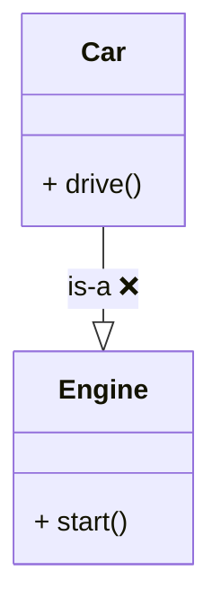

### Bonne pratique — composition

```java
interface Engine { void start(); }
class DieselEngine implements Engine { public void start() { System.out.println("Diesel"); } }
class ElectricEngine implements Engine { public void start() { System.out.println("Electric"); } }

class Car {
    private final Engine engine;
    public Car(Engine engine) { this.engine = engine; }
    public void drive() { engine.start(); System.out.println("Drive"); }
}
```

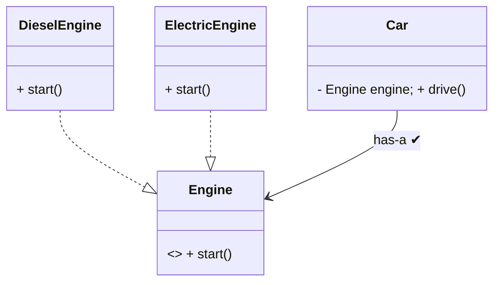

**Règle simple :** commence par **composition**. N’utilise l’héritage que si la relation “est un” est évidente.

---

## 5. Dépendance aux Interfaces

**Idée simple :** les attributs/paramètres doivent être **typés par des interfaces** (pas par des classes concrètes).

### Mauvais

```java
class OrderService {
    private MySQLDatabase db = new MySQLDatabase();
}
```

### Bon

```java
class OrderService {
    private Database db;
    public OrderService(Database db) { this.db = db; }
}
```

### Diagramme

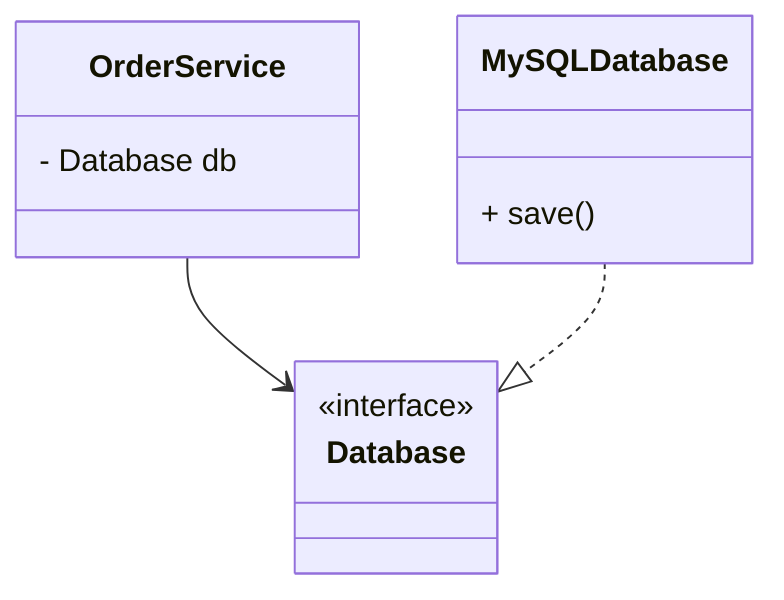

---

# 6. Principe de Substitution de Liskov (LSP)

**Idée simple :** une sous-classe doit **pouvoir remplacer** sa super-classe **sans surprise**.

### Violation

```java
class Bird { void fly() { System.out.println("vole"); } }
class Penguin extends Bird { void fly() { throw new UnsupportedOperationException(); } }
```

➡ Attente brisée : un `Bird` ne devrait pas exploser quand on appelle `fly()`.

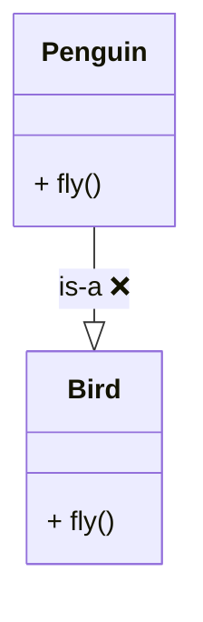

### Correction

```java
interface Bird { void move(); } // contrat correct

class Sparrow implements Bird { public void move() { System.out.println("vole"); } }
class Penguin implements Bird { public void move() { System.out.println("nage"); } }
```

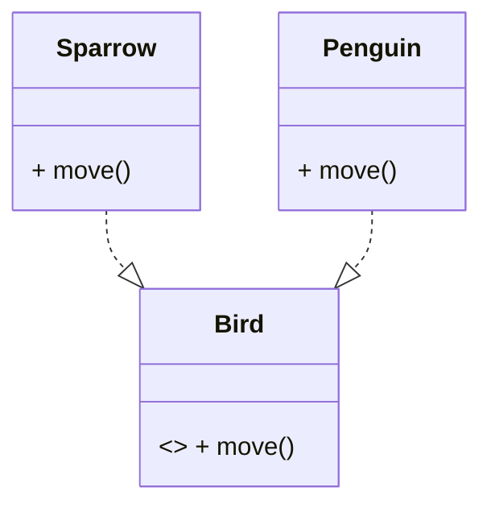

**Règle simple :** définis un **contrat** (interface) qui convient à **toutes** les variantes.

---

# 7. Principe d’Inversion de Dépendance (DIP)

**Idée simple :** le “haut niveau” dépend des **interfaces**, pas des **détails**.

### Violation

```java
class LightBulb { void turnOn() { System.out.println("On"); } }
class Switch {
    private LightBulb bulb = new LightBulb();
    void operate() { bulb.turnOn(); }
}
```

➡ `Switch` est coincé avec `LightBulb`.

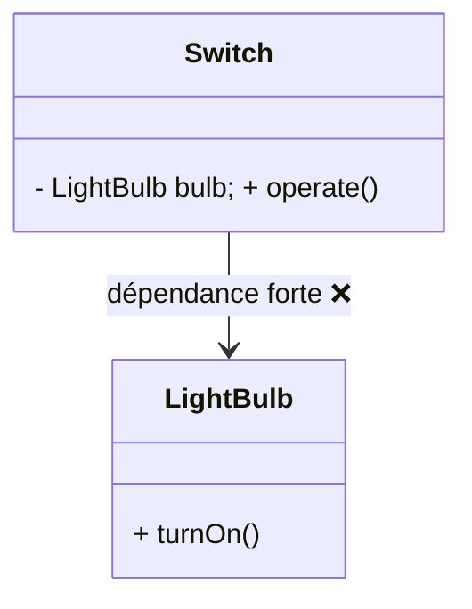

### Respect

```java
interface Switchable { void turnOn(); }

class LightBulb implements Switchable { public void turnOn() { System.out.println("On"); } }
class Fan       implements Switchable { public void turnOn() { System.out.println("Fan"); } }

class Switch {
    private Switchable device;
    public Switch(Switchable device) { this.device = device; }
    void operate() { device.turnOn(); }
}
```

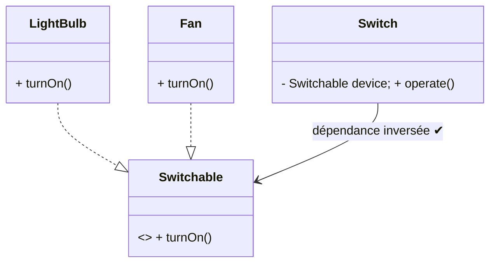

**Règle simple :** toujours viser **interface + injection**.

---

## Conclusion

* Pense **interfaces** + **injection** → couplage faible.
* **SRP** : une classe, une responsabilité.
* **OCP** : ajoute des classes, ne modifie pas l’existant.
* **LSP** : une sous-classe ne casse jamais le contrat.
* **DIP** : haut niveau → **abstractions**, pas détails.

