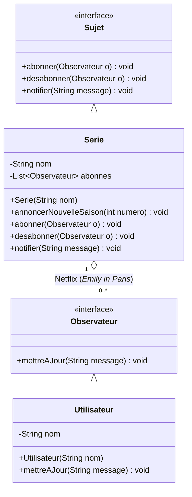
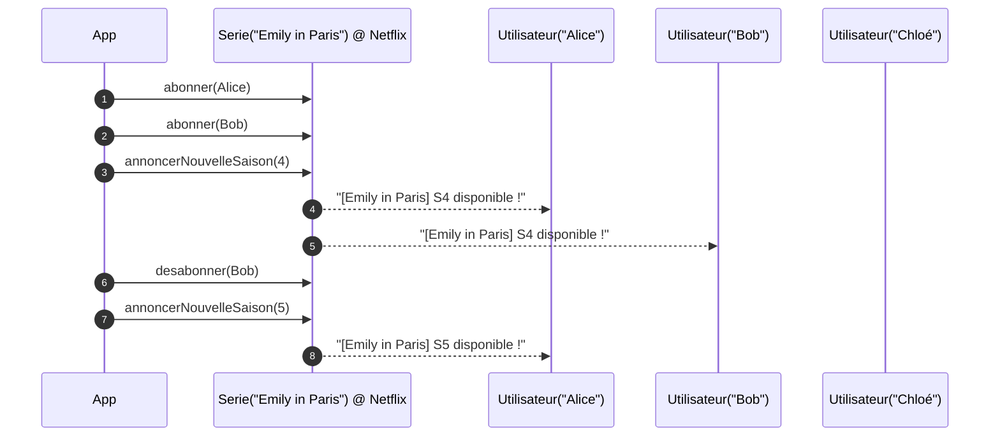

# Exercice — Netflix : alerte “nouvelle saison” (*Emily in Paris*)

## Problème

* Des utilisateurs veulent être **prévenus automatiquement** quand **Emily in Paris** publie une **nouvelle saison**.
* Ils doivent pouvoir **s’abonner** et **se désabonner** librement.
* À l’annonce d’une saison, **seuls les abonnés** de cette série reçoivent la notification.

## Objectif

* Implémenter le **pattern Observer** :

  * **Sujet** : `Serie` (*Emily in Paris*), gère la liste d’abonnés et **notifie**.
  * **Observateur** : `Utilisateur`, **réagit** à la notification.
* API minimale attendue :

  * `abonner(Utilisateur)`, `desabonner(Utilisateur)`, `annoncerNouvelleSaison(int numero)`.

## Scénario à reproduire (console)

1. Créer `Serie emily = new Serie("Emily in Paris")`
2. Créer 3 utilisateurs : `Alice`, `Bob`, `Chloé`
3. Abonner **Alice** et **Bob** (Chloé non-abonnée)
4. `emily.annoncerNouvelleSaison(4)` → notif **Alice**, **Bob**
5. **Bob se désabonne**
6. `emily.annoncerNouvelleSaison(5)` → notif **Alice** seulement

## Contraintes

* Sorties **console** uniquement (pas d’email/SMS réels).
* **Interfaces** pour découpler Sujet / Observateur.
* Code **lisible**, messages clairs.

---

## Mermaid — Diagramme de classes

## Mermaid — Diagramme de séquence

