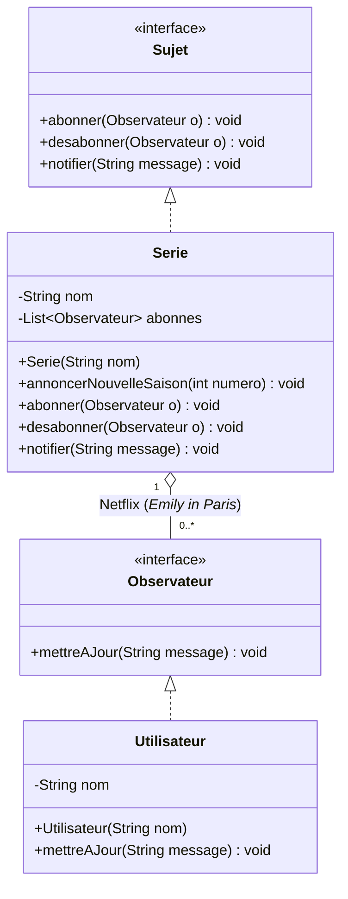
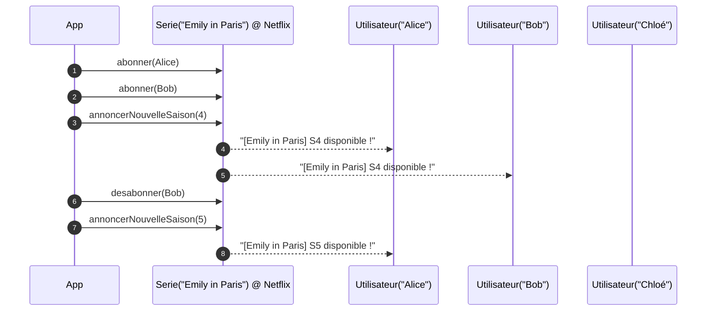

# Exercice — Netflix : alerte “nouvelle saison” (*Emily in Paris*)

## Problème

* Des utilisateurs veulent être **prévenus automatiquement** quand **Emily in Paris** publie une **nouvelle saison**.
* Ils doivent pouvoir **s’abonner** et **se désabonner** librement.
* À l’annonce d’une saison, **seuls les abonnés** de cette série reçoivent la notification.

## Objectif

* Implémenter le **pattern Observer** :

  * **Sujet** : `Serie` (*Emily in Paris*), gère la liste d’abonnés et **notifie**.
  * **Observateur** : `Utilisateur`, **réagit** à la notification.
* API minimale attendue :

  * `abonner(Utilisateur)`, `desabonner(Utilisateur)`, `annoncerNouvelleSaison(int numero)`.

## Scénario à reproduire (console)

1. Créer `Serie emily = new Serie("Emily in Paris")`
2. Créer 3 utilisateurs : `Alice`, `Bob`, `Chloé`
3. Abonner **Alice** et **Bob** (Chloé non-abonnée)
4. `emily.annoncerNouvelleSaison(4)` → notif **Alice**, **Bob**
5. **Bob se désabonne**
6. `emily.annoncerNouvelleSaison(5)` → notif **Alice** seulement

## Contraintes

* Sorties **console** uniquement (pas d’email/SMS réels).
* **Interfaces** pour découpler Sujet / Observateur.
* Code **lisible**, messages clairs.

---

## Mermaid — Diagramme de classes



## Mermaid — Diagramme de séquence




</details>
<summary> Correction </summary>


# Code (package `com.netflix`)

## 1) `Observateur.java`

```java
package com.netflix;

public interface Observateur {
    void mettreAJour(String message);
}
```

## 2) `Sujet.java`

```java
package com.netflix;

public interface Sujet {
    void abonner(Observateur o);
    void desabonner(Observateur o);
    void notifier(String message);
}
```

## 3) `Serie.java`  (Sujet concret)

```java
package com.netflix;

import java.util.ArrayList;
import java.util.List;
import java.util.Objects;

public class Serie implements Sujet {
    private final String nom;
    private final List<Observateur> abonnes = new ArrayList<>();

    public Serie(String nom) {
        this.nom = Objects.requireNonNull(nom);
    }

    public void annoncerNouvelleSaison(int numero) {
        String msg = "[" + nom + "] Nouvelle saison : S" + numero + " disponible !";
        notifier(msg);
    }

    @Override
    public void abonner(Observateur o) {
        if (o != null && !abonnes.contains(o)) {
            abonnes.add(o);
        }
    }

    @Override
    public void desabonner(Observateur o) {
        abonnes.remove(o);
    }

    @Override
    public void notifier(String message) {
        // Copie pour éviter ConcurrentModificationException si un observateur se désabonne pendant la notif
        for (Observateur o : List.copyOf(abonnes)) {
            o.mettreAJour(message);
        }
    }
}
```

## 4) `Utilisateur.java`  (Observateur concret)

```java
package com.netflix;

public class Utilisateur implements Observateur {
    private final String nom;

    public Utilisateur(String nom) {
        this.nom = nom;
    }

    @Override
    public void mettreAJour(String message) {
        System.out.println(nom + " : " + message);
    }
}
```

## 5) `App.java`  (scénario de l’énoncé)

```java
package com.netflix;

public class App {
    public static void main(String[] args) {
        // 1) Créer la série Emily in Paris
        Serie emily = new Serie("Emily in Paris");

        // 2) Créer 3 utilisateurs : Alice, Bob, Chloé
        Utilisateur alice = new Utilisateur("Alice");
        Utilisateur bob   = new Utilisateur("Bob");
        Utilisateur chloe = new Utilisateur("Chloé");

        // 3) Abonner Alice et Bob (Chloé non-abonnée)
        emily.abonner(alice);
        emily.abonner(bob);

        // 4) Annoncer S4 → notifie Alice et Bob
        emily.annoncerNouvelleSaison(4);

        // 5) Bob se désabonne
        emily.desabonner(bob);

        // 6) Annoncer S5 → notifie Alice seulement
        emily.annoncerNouvelleSaison(5);
    }
}
```

---

## Sortie console attendue (exemple)

```
Alice : [Emily in Paris] Nouvelle saison : S4 disponible !
Bob : [Emily in Paris] Nouvelle saison : S4 disponible !
Alice : [Emily in Paris] Nouvelle saison : S5 disponible !
```

> Remarques :
>
> * Implémentation **fidèle au pattern Observer** (découplage via interfaces).
> * **Scenario exact** de l’énoncé : abonnement Alice/Bob, désabonnement Bob, notifications ciblées.
> * Code **minimal et lisible**, aucune dépendance externe.

</details>
