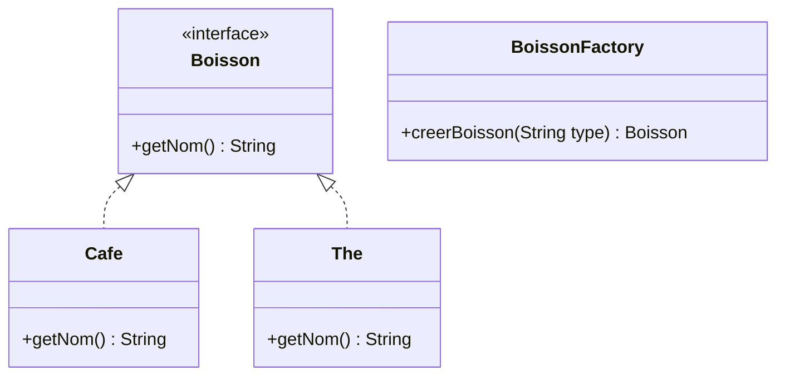

# 1. Introduction

Le **patron de conception Fabrique (Simple Factory)** sert à **centraliser les `new`**.
Au lieu de faire `new Cafe()` ou `new The()` partout, on demande à **une classe Fabrique** de créer l’objet à notre place.
Le code client dit seulement : « donne-moi une boisson chaude “cafe” ou “the” ».
La fabrique décide **quelle classe concrète** utiliser.
Si on change l’implémentation (recette, classe, package…), on le fait **à un seul endroit** : dans la fabrique.


# 2. Exemple minimal : JavaLatte choisit café ou thé

Le café **JavaLatte** a une petite appli Java.

Quand l’utilisateur commande, l’appli doit :

* Créer une **Boisson** de type `Cafe` ou `The`,
* Sans que le reste du programme ait besoin de connaître les classes concrètes.

On définit :

* Une interface `Boisson` avec `getNom()`,
* Deux classes concrètes : `Cafe` et `The`,
* Une **fabrique** `BoissonFactory` avec une méthode `creerBoisson(String type)`,
* Un `main` qui demande à la fabrique de créer la bonne boisson.


# 3. Diagramme de classes (option)




# 4. Code minimal (package `com.cafe`)

### 4.1 Interface `Boisson.java`

```java
package com.cafe;

public interface Boisson {
    String getNom();
}
```

### 4.2 Implémentations concrètes

```java
package com.cafe;

public class Cafe implements Boisson {
    @Override
    public String getNom() {
        return "Café chaud";
    }
}
```

```java
package com.cafe;

public class The implements Boisson {
    @Override
    public String getNom() {
        return "Thé chaud";
    }
}
```

### 4.3 Fabrique simple `BoissonFactory.java`

```java
package com.cafe;

/**
 * Fabrique simple : centralise la création des boissons.
 */
public class BoissonFactory {

    public Boisson creerBoisson(String type) {
        if (type == null) {
            throw new IllegalArgumentException("Type de boisson nul");
        }

        switch (type.toLowerCase()) {
            case "cafe":
                return new Cafe();
            case "the":
                return new The();
            default:
                throw new IllegalArgumentException("Type de boisson inconnu : " + type);
        }
    }
}
```

### 4.4 Programme de démo `App.java`

```java
package com.cafe;

public class App {
    public static void main(String[] args) {
        BoissonFactory factory = new BoissonFactory();

        Boisson b1 = factory.creerBoisson("cafe");
        Boisson b2 = factory.creerBoisson("the");

        System.out.println("Commande 1 : " + b1.getNom());
        System.out.println("Commande 2 : " + b2.getNom());
    }
}
```


# 5. Explication 

* Le `main` **ne connaît pas** les classes `Cafe` et `The`.
  Il connaît uniquement l’interface `Boisson` et la **fabrique**.
* Tous les `new` sont **centralisés** dans `BoissonFactory`.
* Si demain tu ajoutes `Chocolat` ou tu changes l’implémentation de `Cafe`, tu modifies **seulement** la fabrique et/ou la classe concernée, pas tout le reste du code.
