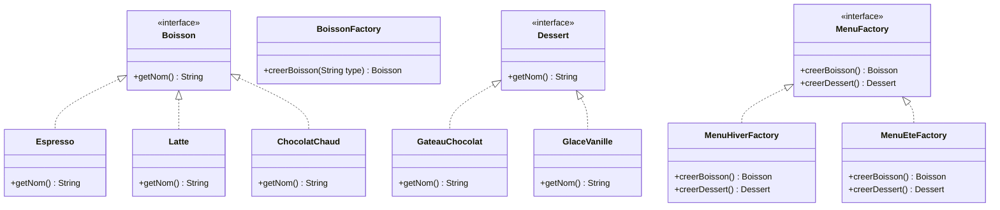
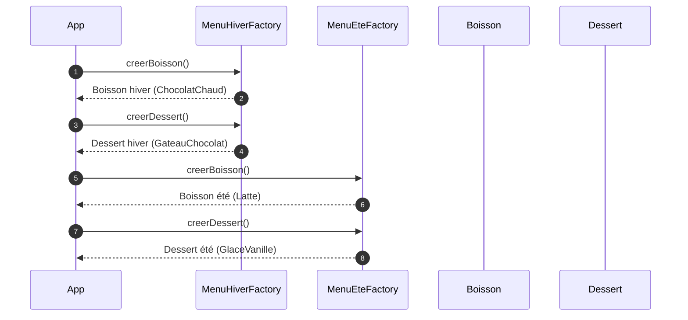

#  Le café JavaLatte et les menus saisonniers

Le café **JavaLatte** a une application mobile.
L’appli doit :

1. Créer des **boissons** à la demande (espresso, latte, chocolat chaud, etc.),
2. Et proposer des **menus saisonniers** :

   * **Menu d’hiver** : boisson chaude + dessert réconfortant,
   * **Menu d’été** : boisson fraîche + dessert léger.

Le patron **Fabrique** (Simple Factory / Factory Method) est utilisé pour **centraliser la création** des boissons, afin d’éviter d’éparpiller des `new Espresso()` partout dans le code.

Le patron **Fabrique abstraite (Abstract Factory)** sert, lui, à **créer des familles d’objets cohérents** (un *menu* complet = une boisson + un dessert), sans que le client connaisse les classes concrètes exactes.

> Idée clé :
>
> * La **Fabrique** → crée **un type d’objet** (ici, une boisson) selon un paramètre.
> * La **Fabrique abstraite** → crée **une famille d’objets** compatibles (boisson + dessert) selon une “famille” (hiver/été).


## Exercice demandé 

On veut :

1. Une **fabrique simple** qui crée des objets `Boisson` en fonction d’un `String` :

   * `"espresso"`, `"latte"`, `"chocolat"` → objets concrets.
2. Une **fabrique abstraite** `MenuFactory` qui peut créer :

   * `Boisson`
   * `Dessert`
3. Deux implémentations :

   * `MenuHiverFactory`
   * `MenuEteFactory`
4. Un petit programme de démonstration qui :

   * Crée une boisson via la fabrique simple,
   * Crée un menu d’hiver,
   * Crée un menu d’été,
   * Affiche ce qui est servi.


## (Option) Diagramme de classes — Vue globale




## (Option) Diagramme de séquence — Choisir un menu




#  Code (package `com.cafe`)

> Version **simple**, prête à montrer aux étudiants.
> Ils peuvent d’abord **lire**, puis on peut leur demander d’implémenter une variante (autre boisson, autre menu, etc.).

## 1) Interface `Boisson.java`

```java
package com.cafe;

public interface Boisson {
    String getNom();
}
```

## 2) Implémentations concrètes de `Boisson`

```java
package com.cafe;

public class Espresso implements Boisson {
    @Override
    public String getNom() {
        return "Espresso";
    }
}
```

```java
package com.cafe;

public class Latte implements Boisson {
    @Override
    public String getNom() {
        return "Latte";
    }
}
```

```java
package com.cafe;

public class ChocolatChaud implements Boisson {
    @Override
    public String getNom() {
        return "Chocolat chaud";
    }
}
```


## 3) Fabrique simple : `BoissonFactory.java`

```java
package com.cafe;

/**
 * Fabrique simple : centralise la création de Boisson.
 */
public class BoissonFactory {

    public Boisson creerBoisson(String type) {
        if (type == null) return null;

        switch (type.toLowerCase()) {
            case "espresso":
                return new Espresso();
            case "latte":
                return new Latte();
            case "chocolat":
                return new ChocolatChaud();
            default:
                throw new IllegalArgumentException("Type de boisson inconnu : " + type);
        }
    }
}
```


## 4) Interface `Dessert.java`

```java
package com.cafe;

public interface Dessert {
    String getNom();
}
```

## 5) Implémentations concrètes de `Dessert`

```java
package com.cafe;

public class GateauChocolat implements Dessert {
    @Override
    public String getNom() {
        return "Gâteau au chocolat";
    }
}
```

```java
package com.cafe;

public class GlaceVanille implements Dessert {
    @Override
    public String getNom() {
        return "Glace à la vanille";
    }
}
```

---

## 6) Fabrique abstraite : `MenuFactory.java`

```java
package com.cafe;

/**
 * Fabrique abstraite : crée une famille cohérente (Boisson + Dessert).
 */
public interface MenuFactory {
    Boisson creerBoisson();
    Dessert creerDessert();
}
```

## 7) `MenuHiverFactory.java`

```java
package com.cafe;

public class MenuHiverFactory implements MenuFactory {

    @Override
    public Boisson creerBoisson() {
        // En hiver : boisson bien chaude
        return new ChocolatChaud();
    }

    @Override
    public Dessert creerDessert() {
        // Dessert gourmand
        return new GateauChocolat();
    }
}
```

## 8) `MenuEteFactory.java`

```java
package com.cafe;

public class MenuEteFactory implements MenuFactory {

    @Override
    public Boisson creerBoisson() {
        // On pourrait imaginer un "Latte glacé"
        return new Latte();
    }

    @Override
    public Dessert creerDessert() {
        return new GlaceVanille();
    }
}
```


## 9) Programme de démo : `App.java`

```java
package com.cafe;

public class App {
    public static void main(String[] args) {

        // 1) Utilisation de la FABRIQUE SIMPLE
        BoissonFactory boissonFactory = new BoissonFactory();

        Boisson b1 = boissonFactory.creerBoisson("espresso");
        Boisson b2 = boissonFactory.creerBoisson("chocolat");

        System.out.println("Fabrique simple :");
        System.out.println(" - " + b1.getNom());
        System.out.println(" - " + b2.getNom());
        System.out.println();

        // 2) Utilisation de la FABRIQUE ABSTRAITE
        MenuFactory menuHiver = new MenuHiverFactory();
        MenuFactory menuEte   = new MenuEteFactory();

        Boisson boissonHiver = menuHiver.creerBoisson();
        Dessert dessertHiver = menuHiver.creerDessert();

        Boisson boissonEte = menuEte.creerBoisson();
        Dessert dessertEte = menuEte.creerDessert();

        System.out.println("Menu d'HIVER :");
        System.out.println(" Boisson : " + boissonHiver.getNom());
        System.out.println(" Dessert : " + dessertHiver.getNom());
        System.out.println();

        System.out.println("Menu d'ÉTÉ :");
        System.out.println(" Boisson : " + boissonEte.getNom());
        System.out.println(" Dessert : " + dessertEte.getNom());
    }
}
```


## Explication pédagogique rapide (pour toi / pour tes notes de cours)

* **Fabrique simple (`BoissonFactory`)**
  Centralise les `new Espresso()`, `new Latte()`, etc.
  → Le code client n’a plus besoin de connaître les classes concrètes.

* **Fabrique abstraite (`MenuFactory`)**
  Décrit une famille d’objets : `creerBoisson()` + `creerDessert()`.
  → `MenuHiverFactory` et `MenuEteFactory` garantissent que **boisson et dessert vont ensemble**.

---

## Idées d’exercices dérivés pour tes étudiants

Tu peux leur demander de :

1. **Ajouter un nouveau type de boisson** (`TheVert`, `SmoothieMangue`)
   et de mettre à jour `BoissonFactory`.
2. Créer une nouvelle fabrique abstraite `MenuVeganFactory` avec :

   * boisson : `LatteSoja`,
   * dessert : `GateauVegan`.
3. Écrire un petit menu texte où l’utilisateur choisit :

   * “1 = hiver, 2 = été, 3 = vegan”
     puis afficher le menu correspondant (en utilisant `MenuFactory`).

