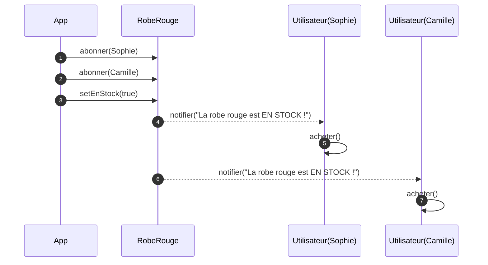
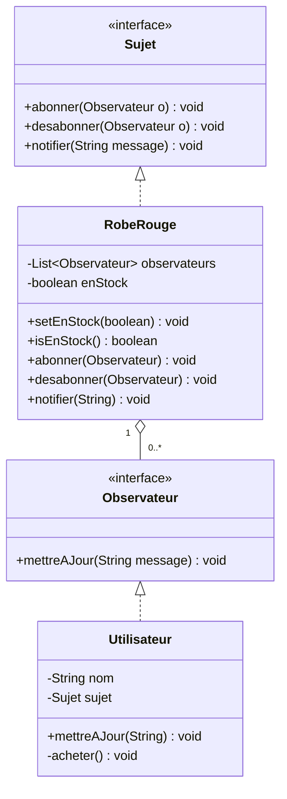
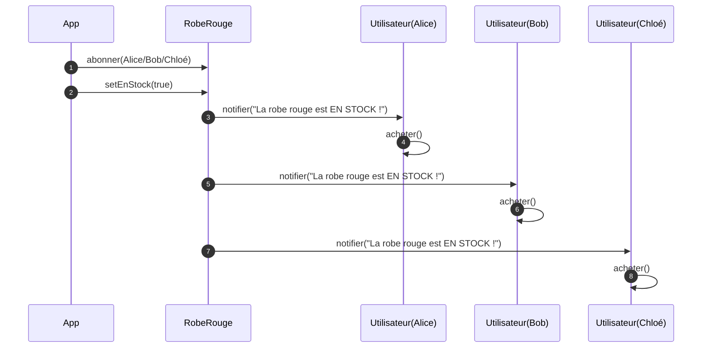

# “Sophie et la robe rouge”

Sophie cherche depuis des semaines **la robe rouge** d’une collection très demandée. Le magasin met parfois l’article **en stock**, puis il disparaît en quelques minutes. Sophie ne veut pas rafraîchir la page toutes les heures : elle veut **être prévenue automatiquement** dès que la robe redevient disponible. D’autres clientes (Camille, Lina) veulent la même chose. Le magasin doit donc offrir un mécanisme pour que **chacune s’abonne** aux alertes et reçoive **immédiatement** une notification quand l’état passe à **en stock**, sans que la boutique doive gérer les clientes une par une.

> C’est exactement le **pattern Observer** : la robe (Sujet) **notifie** toutes les clientes abonnées (Observateurs) quand son **état change**.

---

## (Option) Diagramme de séquence Mermaid avec Sophie



## (Option) Appel minimal avec Sophie (package `com.magasin`)

```java
package com.magasin;

public class App {
    public static void main(String[] args) {
        RobeRouge robe = new RobeRouge();

        Utilisateur sophie  = new Utilisateur("Sophie", robe);
        Utilisateur camille = new Utilisateur("Camille", robe);

        robe.abonner(sophie);
        robe.abonner(camille);

        // La robe redevient disponible → toutes les abonnées sont notifiées
        robe.setEnStock(true);
    }
}
```


# Solution


#  Diagramme de classes



# Mermaid — Diagramme de séquence



---

# Code (package `com.magasin`)

## 1) `Observateur.java`

```java
package com.magasin;

public interface Observateur {
    void mettreAJour(String message);
}
```

## 2) `Sujet.java`

```java
package com.magasin;

public interface Sujet {
    void abonner(Observateur o);
    void desabonner(Observateur o);
    void notifier(String message);
}
```

## 3) `RobeRouge.java`

```java
package com.magasin;

import java.util.ArrayList;
import java.util.List;
import java.util.Objects;

public class RobeRouge implements Sujet {
    private final List<Observateur> observateurs = new ArrayList<>();
    private boolean enStock = false;

    public void setEnStock(boolean enStock) {
        this.enStock = enStock;
        if (enStock) {
            notifier("La robe rouge est EN STOCK !");
        } else {
            notifier("La robe rouge n'est plus en stock.");
        }
    }

    public boolean isEnStock() { return enStock; }

    @Override
    public void abonner(Observateur o) {
        if (o != null && !observateurs.contains(o)) {
            observateurs.add(o);
        }
    }

    @Override
    public void desabonner(Observateur o) {
        observateurs.remove(o);
    }

    @Override
    public void notifier(String message) {
        for (Observateur o : List.copyOf(observateurs)) {
            o.mettreAJour(Objects.requireNonNullElse(message, ""));
        }
    }
}
```

## 4) `Utilisateur.java`

```java
package com.magasin;

public class Utilisateur implements Observateur {
    private final String nom;
    private final Sujet sujet; // pour se désabonner si souhaité

    public Utilisateur(String nom, Sujet sujet) {
        this.nom = nom;
        this.sujet = sujet;
    }

    @Override
    public void mettreAJour(String message) {
        System.out.println(nom + " : " + message);
        if (message.contains("EN STOCK")) {
            acheter();
            // Exemple : se désabonner après achat
            // sujet.desabonner(this);
        }
    }

    private void acheter() {
        System.out.println(nom + " : J'achète la robe");
    }
}
```

## 5) `App.java`

```java
package com.magasin;

public class App {
    public static void main(String[] args) {
        RobeRouge robe = new RobeRouge();

        Utilisateur alice = new Utilisateur("Alice", robe);
        Utilisateur bob = new Utilisateur("Bob", robe);
        Utilisateur chloe = new Utilisateur("Chloé", robe);

        robe.abonner(alice);
        robe.abonner(bob);
        robe.abonner(chloe);

        // 1) Pas en stock
        robe.setEnStock(false);

        // 2) Devient en stock → notifie tout le monde
        robe.setEnStock(true);

        // 3) Bob se désabonne (facultatif)
        robe.desabonner(bob);

        // 4) Nouvelle notification (Alice & Chloé seulement)
        robe.setEnStock(true);
    }
}
```
